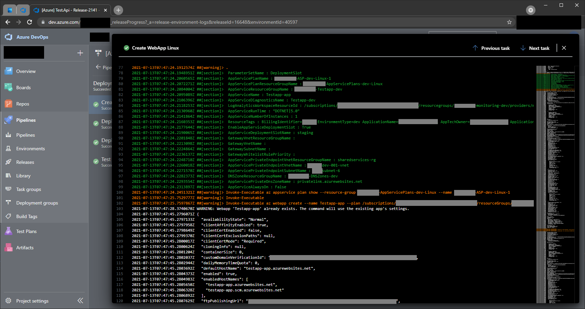

[[_TOC_]]

# Introduction to AzDocs

Welcome on the AzDocs (Azure Documentation) Wiki.

The AzDocs are a boilerplate & knowledgebase to get you and your team started with Azure in no time while keeping Security & Compliancy in place. The goal is to have BICEP scripts & PowerShell/Azure CLI snippets for upserting Azure resources that are secure & compliant to the highest level of requirements along with examples and best practices. This library does have a bias about certain things which, in our experience, gets your team started faster.

We started in November 2020 with creating a set of Azure CLI scripts which helped our teams to get up and running faster using Azure. These scripts we now call AzDocs v1.

In july 2022 we've started with Bicep templates which allow us to do the same as the CLI scripts but even better. The main drivers for this switch are:

- Bring down deployment time: old pipelines sometimes took 30+ minutes. The bicep pipelines take mere minutes.
- Act in a desired state way: define how the platform should look and wish Azure Resource Managed good luck in getting to that state instead of telling it what to do to get to a certain state.

## [Documentation](/Azure/General-Documentation)

We recommend looking at the documentation before going into the Azure CLI scripts or Bicep templates. You can find this documentation here: [Documentation](/Azure/General-Documentation).
This documentation applies to both the CLI Scripts as the Bicep templates and should be considered more of a "general knowledge" piece of documentation.

## [AzDocs v1](/Azure/AzDocs-v1)

These are the v1 Azure CLI/PowerShell snippets. They are still perfectly fine to use. However, if you are starting out on a new platform, we recommend switching to AzDocs v2.

## [AzDocs v2](/Azure/AzDocs-v2)

These are the v2 Bicep templates which are faster, better & stronger! This is where the real magic happens!

# Why use this boilerplate

The idea behind this boilerplate is that everyone wants a secure stack without having to do the whole compliancy & security setup yourself. A good example is that in 2021 it's not acceptable that you use non SSL HTTP connections. This means that, in all the scripts we write, HTTPS will be enforced. You get these general sense choices for free in your application stack. Another good example is that we strive to enable full logging for all components to a central Log Analytics Workspace, so that if you need logging at some point, you will have it.

> TLDR; you don't want to figure out everything by yourself and build secure & compliant platforms :).

Another major reason/benefit to use this boilerplate is because we fixed Azure CLI in Azure DevOps Pipelines. By default, whenever a CLI statement crashes, your pipeline does not always break. We've wrapped all of our statements into the so called `Invoke-Executable` statement which manages this behaviour for you. Next to this huge benefit, it adds another huge benefit: logging. Don't you hate the way of logging within our pipelines? We do too! So we've improved the logging when using this boilerplate. Let me simply show you by a screenshot:

As you can see, all parameters get printed (secrets will be hidden ofcourse!) and and all actual CLI statements that are being done by the scripts are printed as well. This allows you to quickly debug & fix things going wrong in your pipelines!

And last but certainly not least: we've unified the way to enable debug information in your pipeline & Azure CLI. It's as simple as setting the default `System.Debug` to `true` in your pipeline variables. The `Invoke-Executable` wrapper will make sure the CLI statements will be appended with `--debug`!
