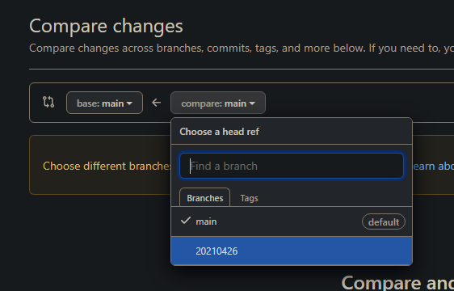
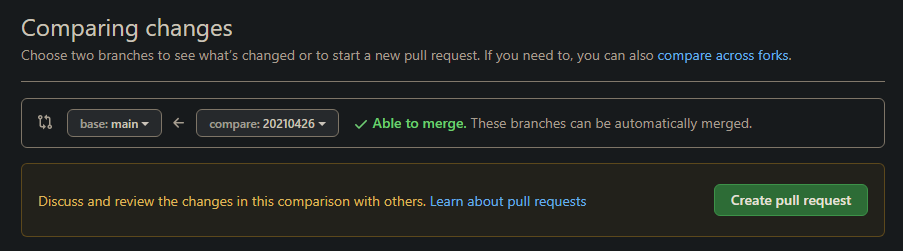
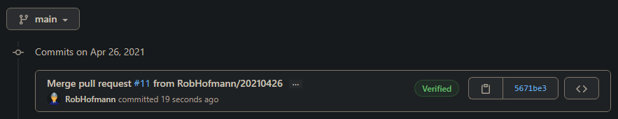

[[_TOC_]]

# Introduction
Welcome on the azure documentation site of the Azure Platform Provisioning scripts (AzDocs).

The goal is to have snippets for creating Azure resources that are secure & compliant to the highest level of requirements.

Please note that this is a **Work In Progress** effort. Multiple companies are currently backing, contributing & using this for their production environments.

[Azure CLI](/Azure/Azure-CLI-Snippets)

# Why use this boilerplate
The idea behind this boilerplate is that everyone wants a secure stack without having to do the whole compliancy & security setup yourself. A good example is that in 2021 it's not acceptable that you use non SSL HTTP connections. This means that, in all the scripts we write, HTTPS will be enforced. You get these general sense choices for free in your application stack. Another good example is that we strive to enable full logging for all components to a central Log Analytics Workspace, so that if you need logging at some point, you will have it.

> TLDR; you don't want to figure out everything by yourself :).

# Core Concepts / Architecture
There are a few core concept in this boilerplate which are essential for a successful implementation. In this chapter those core concepts are described.
 - CICD is leading --> Your platform should be able to burn and we should be good to go.
    - This means your resources, variables & secrets etc. are provisioned from your CICD pipelines towards the Azure platform.
 - Backwards compatible; scripts which are created should not break previous versions unless it's absolutely not possible to create backwards compatibility.
 - You want to create a resourcegroup per application stack
    - This means your API, portal, database etc. which are needed for running your application are all in the same resourcegroup, but another application stack is in it's own resource group.
 - There is one or more shared resourcegroups for shared components
    - For example if you use an application gateway to expose multiple application stacks to the internet, this will be in a shared RG with for example the VNET which is shared between your platforms.
    - Those shared resources are mainly done for cost reductions. You dont want to host an Application Gateway for each application because it's simply unnecessary.
 - Any HTTPS service exposed outside of Azure is exposed through an Azure Application Gateway. Also services which are being exposed to your on-premises network. The reason is that the Application Gateway has some extra security measures in place which reduces your attack surface. This complies with the [Zero trust architecture](#zero-trust-architecture).

## Resource naming best practises
Make sure that when you start using this boilerplate you come up with a good naming convention for your implementation. There are a few general rules of thumb which you can follow to get a good naming scheme.
 - Use the same naming structure for all of your resourcegroups. For example `<Teamname>-<ApplicationStackName>-<EnvironmentName>` or simply ` <ApplicationStackName>-<EnvironmentName>`.
 - It's extremely recommended to use the Environment name in your resource names for easy understanding & easy automation. This allows you to name all environments you create the same, except for the environment name. For example; a webapp will be called `myteam-myapp-dev` in dev and `myteam-myapp-prd` in production.
    - In Azure DevOps Release pipelines you can use the `$(Release.EnvironmentName)` to use the current stage name for spinning up resources in your Azure platform. This means that if you name your stages `dev`, `acc` and `prd` that you can use `$(Release.EnvironmentName)` in your resources names which will cause the resources to include those `dev`, `acc` and `prd` references.
 - If you have only 1 instance of a specific resourcetype (now and in the future) in each resourcegroup, its recommended to just simply name the resource the same as your resourcegroup.
    - For example: you want 1 application insights resource per application stack. Just give the same name to the appinsights and the resourcegroup for simplicity sake.

## Zero trust architecture
We follow the [zero trust architecture](https://en.wikipedia.org/wiki/Zero_trust_security_model) principle. We recommend you doing the same thing. The biggest reason we are mentioning this is because we see in the field that a lot of companies think that IP whitelisting is enough security. In short: Do not IP whitelist a calling service and think this is plenty of security. Always check the requests on multiple levels.

## SaaS --> PaaS --> IaaS
The ideology we follow is that we'd rather have SaaS, then PaaS and last IaaS. Simply because of the lack of maintenance in SaaS and the heaviest maintenance in IaaS.
For the same reason we try to avoid containers, since we still need to update our runtimes in these (JRE/.NET versions etc).

## Azure CLI unless
In this boilerplate we investigated ARM templates, Azure PowerShell & Azure CLI. We choose to have the following order:
 1. Azure CLI
 2. Azure PowerShell
 3. ARM Templates

The reason for this is that Azure CLI is extremely simple to learn for new developers. This has currently been battle tested at multiple companies who all said CLI was the easiest to learn. We try to avoid ARM Templates because of 2 main reasons: it's the most complex & fiddly to work with and also the reusability of arm templates is suboptimal (yes we tried linked & nested templates but they don't suit our needs). Also ARM templates doesn't give us the freedom in making choices based on the user input.

## Pipelines
TODO

### Service Principal Setup
TODO

# Which components are available & when to use them?
Currently we've focussed on the following:
 - Some basic network components
 - Edge layer --> Application Gateway
 - App Layer --> App Services, Function Apps & RedisCache
 - Data layer --> Storage Accounts, Multiple relational databases & Keyvault.
 - Supporting tools --> Application Insights, Azure Monitor & Azure Log Analytics Workspace
 - Some experimental components --> App Configuration & Contianer Instances

# Prerequisites
 - An Azure DevOps environment (you are probably reading this inside one right now).
 - One or more azure subscriptions

# How to use the scripts
To use these scripts you simply add a Azure CLI step to your pipeline. Make sure to fill in the right subscription you want to use in the step and select the script from this repo you want to execute. If you are using classic release pipelines, we recommend making a taskgroup per script so you can re-use them easily.

# Guidelines for creating new scripts
If you want to create new scripts and PR them into this repo, make sure to follow the [Azure CLI unless](#azure-cli-unless) rule. We make use of creating [powershell advanced functions](https://docs.microsoft.com/en-us/powershell/module/microsoft.powershell.core/about/about_functions_advanced?view=powershell-7.1). A general advise is to take a look at other scripts and copy those and go from there.

The start of every script should look something like this:
```powershell
[CmdletBinding()]
param (
    [Parameter(Mandatory)][string] $FictionalParameter,    
)

#region ===BEGIN IMPORTS===
Import-Module "$PSScriptRoot\..\AzDocs.Common" -Force
#endregion ===END IMPORTS===

Write-Header -ScopedPSCmdlet $PSCmdlet
```
and the end should look something like this:
```powershell
Write-Footer -ScopedPSCmdlet $PSCmdlet
```

## Coding Convention
We use the `Allman` code formatting preset from VSCode. Also we disable the `openBraceOnSameLine` setting in powershell. In theory your VSCode should already do this for you, since we've checked in our [settings.json](../.vscode/settings.json) to the repository.

### Naming
 - Our script & function parameters are written CamelCase
 - Local variables are all lowercase
 - Functionnames are written CamelCase
 - Names should be logical, recognizable and should avoid confusion
 - We try to follow the [Noun-verb](https://docs.microsoft.com/en-us/powershell/scripting/developer/cmdlet/approved-verbs-for-windows-powershell-commands?view=powershell-7.1) naming for functions

# GIT
We are using a more-or-less complex GIT setup to fulfil our needs. The generic library you are watching right now should be sharable between companies at all times. This means that no company related data/rules should be implemented in this boilerplate. However, you probably have scripts & documentation which actually does contain logics or information of/for your company. To deal with this, we've created a 2-tier GIT repo. We created a company specific repo with this generic repo, in it, as a GIT submodule. This implies that commiting, pulling & pushing gets a little more complicated. To help you out, this paragraph should tell you how the workflow should work.

First of all you need to mirror [the upstream github repo](https://github.com/RobHofmann/Azure.PlatformProvisioning) to your own Azure DevOps instance as a working repo.

## Mirroring the upstream repo to your own Azure DevOps instance
TODO

## Recommended GIT structure


## How to keep your repositories in sync with upstream
*For the next procedure you will need an account at GitHub. Make sure to have this before continuing. You can create a GitHub account [here](https://github.com/join).*

The generic repo will have 2 remote's if you also want to contribute to this project or get new updates from this project. So after mirroring [the upstream github repo](https://github.com/RobHofmann/Azure.PlatformProvisioning) to your own Azure DevOps instance, you want to clone the repository to your local machine.

> NOTE: Next to the working company repository with the generic repository inside (as explained in [the GIT paragraph](#git)) you daily use, we tend to keep the upstream in a separate folder on our computer aswell for syncing our origin with the upstream repo.

First clone the repo to your local disk with:

`git clone <repo url>`

After doing this you enter the freshly created repo folder and use this command to add the upstream remote to your local repo:

`git remote add upstream https://github.com/RobHofmann/Azure.PlatformProvisioning.git`

Doing so will give you two remotes: `origin` & `upstream`.

### Pulling new changes from upstream (Github) to your origin repo
*Make sure you followed the information from [How to keep your repositories in sync with upstream](#how-to-keep-your-repositories-in-sync-with-upstream) first.*

For this example lets assume that some work has been done by other companies and you want the latest & greatest changes for your company. Since our philosophy is that `upstream` should always be able to merge to `origin` we pull directly into our `origin/main` branch to avoid squash commits over and over between `upstream` & `origin`. Follow these steps to get the latest from `upstream` to your `origin`:

```cmd
git checkout main
git pull upstream main
git push origin main
```


*Updated main branch*

Your repository is now up to date.

### Commit the work you've done to the upstream (GitHub) repo
*Make sure you followed the information from [How to keep your repositories in sync with upstream](#how-to-keep-your-repositories-in-sync-with-upstream) first.*

Let's assume you've done some work on your `origin` and at some point in time you want to sync this back to the `upstream`. We do this by creating a new branch and pushing it to the upstream. We need to make sure we use the latest version of main to create our PR Branch from:

```cmd
git checkout main
git pull origin main
git checkout -b 20210426
git push upstream 20210426
```

This will create a new branch in the upstream repo. After this you can [create a PR](https://github.com/RobHofmann/Azure.PlatformProvisioning/compare) on github. Select the branch you just created from the "compare" list.



*Select the compare branch*

Now confirm the selected branch by clicking the green `Create pull request` button.



*Confirm the branch selection*

Finally enter the name of your PR (I recommend naming it the same as the branch you created).


*Create a PR on GitHub*

Done! From here multiple people will review this PR. Eventually the PR will be accepted or rejected based on the feedback & discussion. Make sure to reply to questions being asked & actively participate in the discussion revolving your PR.



*Accepted & Merged PR*

# Application Gateway
When we started this documentation, we promised eachother to not write anything about individual components. However, since we've chosen to only use the Application Gateway (AppGw) as our edge layer component, we decided it is a good idea to say something revolving this component and it's complexity (and our automation in this). Creating an AppGw is easy, but mastering one is a little harder. We've chosen to create our own SSL Policies for our AppGw's and to automate the hell out of this component due to its complexity (see [the create entrypoint script](../src/AzDocs.Common/public/AppGateway-Helper-Functions.ps1) if you want to know what i'm talking about).

## Creating an Application Gateway
Creating an application gateway is easy. Simply use the [Create Application Gateway](/Azure/Azure-CLI-Snippets/Application-Gateway/Create-Application-Gateway) script to create the App Gateway.

> TODO: Currently there is no DDOS Protection & WAF setup done in here yet.

## SSL Policy
The next thing you want to do is setup secure SSL policies. By default the Gateway will support TLS 1.2 with a set of ciphers (predefined profile AppGwSslPolicy20170401S). We've found that this default set of ciphers isn't the strongest option available. We've set our Gateway to the following:

Minimal TLS Version: `1.2`

Ciphers in order:
 - `TLS_ECDHE_ECDSA_WITH_AES_256_GCM_SHA384` <-- Strong
 - `TLS_ECDHE_ECDSA_WITH_AES_128_GCM_SHA256` <-- Strong
 - `TLS_ECDHE_RSA_WITH_AES_256_GCM_SHA384` <-- Strong
 - `TLS_ECDHE_RSA_WITH_AES_128_GCM_SHA256` <-- Strong
 - `TLS_DHE_RSA_WITH_AES_256_GCM_SHA384` <-- Strong
 - `TLS_DHE_RSA_WITH_AES_128_GCM_SHA256` <-- Strong
 - `TLS_RSA_WITH_AES_256_GCM_SHA384` <-- Fallback. Strong enough, but mainly for backwards compatibility
 - `TLS_RSA_WITH_AES_128_GCM_SHA256` <-- Fallback. Strong enough, but mainly for backwards compatibility

The strong ciphers are supported by mainly all devices since 2014.

If you are still using Windows Server 2012 R2 machines, follow [this link](https://docs.microsoft.com/nl-nl/mem/configmgr/core/plan-design/security/enable-tls-1-2-client) to make TLS 1.2 work with this OS.

## Creating Entrypoints
Creating entrypoints can be done using [Create Application Gateway Entrypoint for ContainerInstance](/Azure/Azure-CLI-Snippets/Application-Gateway/Create-Application-Gateway-Entrypoint-for-ContainerInstance) (Azure Container Instances) or [Create Application Gateway Entrypoint for DomainName](/Azure/Azure-CLI-Snippets/Application-Gateway/Create-Application-Gateway-Entrypoint-for-DomainName) (AppServices, FunctionApps). These scripts will more or less do the following for you:
 - Handle naming for you based on the ingress domain name you are using
 - Handle permissions, identities, authentication & authorization between the Application Gateway & Keyvault
 - Handle the certificate (uploading in keyvault,  linking to the application gateway & setting it in your HTTPS listener)
 - Update the certificate if you pass a renewed certificate in the keyvault, AppGw & HTTPS listener
 - Create the following components for you (again automatically named based on the ingress domainname): Backendpool, Healthprobe, HTTP Setting, HTTPS Listener, routing rules a HTTP listener with autoredirect to HTTPS.
 - The script will make sure everything is setup correctly & that your backend is reachable with a healthcheck. Your pipeline will fail if the backend is not reachable.

# Networking
There are different ways of doing networking within Azure. By default resources will either be public or have an IP Whitelist. By design we don't want to use public resources or use IP whitelists because of the potential insecurities in this. We made the choice to use two different ways of supporting connectivity; VNet whitelisting & Private Endpoint.
The general rule of thumb should be to use VNet whitelisting where applicable. If thats not possible we use private endpoints. If that is unavailable aswell, we fallback to public access with plain IP whitelists.
Another rule of thumb is to keep in mind that we don't want to use methods of vnet connectivity where we have to sacrifice a whole subnet due to a delegation (vnet integration for appservices have this problem) unless there is no other way. The reason for this is that this costs a lot of private IP's. If you have a tight private IP space, don't waste them on delegations :).

## VNet whitelisting
As mentioned, VNet whitelisting is the desired way of connecting your resources within Azure. The description we'd like to use is that VNet whitelisting means you allow a subnet in your VNet to connect to your Azure resource. Microsoft does some nice public/private network translation magic for this. The benefit is that you can choose any vnet/subnet combination to be whitelisted without the vnets actually [peered](https://docs.microsoft.com/en-US/azure/virtual-network/virtual-network-peering-overview), where private endpoints will limit you to stuff which is in the same vnet as the private endpoint. Technically this means that your public endpoint will be enabled. However Microsoft allows you to define which private resources (resources from within a vnet) can reach this public endpoint. By default this method will block all public traffic to the Azure resource, which is desired in our eyes.

## Private Endpoints
We see [private endpoints](https://docs.microsoft.com/en-US/azure/private-link/private-endpoint-overview) as a fallback scenario for resources that do not support VNet whitelisting. Also this is the main way of connecting from on-premises to Azure resources. The idea behind private endpoint is that your Azure Resource will get a "leg" for incoming traffic in a subnet within your vnet. Also microsoft offers the option for the DNS entry of your resource to be changed from the public resource IP to the private endpoint ip.

Example:
If you have a SQL server with the name `testserver`, you will get a DNS record out of the box which looks like `testserver.database.windows.net` which resolves to a public ip, lets say `50.20.30.40`. It means that whenever you connect to your SQL Database you will set the connectionstring to `testserver.database.windows.net` and your application will resolve this to `50.20.30.40`.
Whenever we enable the private endpoint feature, microsoft will actually create a new DNS record `testserver.privatelink.database.windows.net` with your private ip, lets say `10.0.0.5`. The next step Microsoft does for you, is that within your VNet context the "public" DNS entry `testserver.database.windows.net` will resolve to a CNAME `testserver.privatelink.database.windows.net` which in its turn resolves to `10.0.0.5`. So within your VNet you will start connecting on a private IP, which allows you to completely disable the public endpoint if desired. If you resolve `testserver.database.windows.net` from outside your VNet, it will keep resolving to `50.20.30.40` (since you don't have connectivity to the private endpoint there).

> NOTE: One of the funny things we noticed is that for AppServices & functions in particular, whenever you add a private endpoint you are unable to get public access working even adding public ip's to your whitelist. You can fix this by using an [Application Gateway](https://docs.microsoft.com/en-US/azure/application-gateway/overview) in front of this App Service/FunctionApp with private endpoint.

### DNS
Whenever you want to use private endpoint there is a few things to know. The first of these things is that you will need a non-default DNS server to resolve your private endpoint DNS entries. The default DNS server from Azure will keep returning the public IP, which is undesired for your private endpoint situation. This means that you will need to define the "private endpoint dns server" in your Virtual Network as being the DNS server to use. The address to resolve your privatelink DNS entries from is `168.63.129.16`.

> OPTIONAL: If you do not want to set this DNS server for the whole VNet, there are ways to set this on a resourcelevel. For example adding `WEBSITE_DNS_SERVER=168.63.129.16` to your [application settings](https://docs.microsoft.com/en-us/azure/app-service/configure-common) in your App Service does this.

### Route your traffic through the VNet
Another thing to know when you use private endpoints is that you need to make sure your resources will route all traffic through the VNet. For example: you need to add an [application setting](https://docs.microsoft.com/en-us/azure/app-service/configure-common) to your AppService that defines that you route this traffic through your VNet integration towards the VNet. For AppServices you can do this adding `WEBSITE_VNET_ROUTE_ALL=1` to your application settings.

### How to deploy to private resources: Azure DevOps Private Agents
A challenge you will be facing when you use private endpoints, is that your Azure DevOps hosted agents are unable to connect to your (now) private resource. This means that, for example, an application deploy to an appservice or adding a file to your storage account will fail. This means that you will have to host a private Azure DevOps agent inside your VNet to connect through the private endpoints. 

## On-premises networks
There are several ways of connecting your resources in azure from & to on-premises resources:
 - Azure ExpressRoute
 - Site-to-site VPN using the Virtual Network Gateway
 - Hybrid connections

Currently this stack has been tested using the ExpressRoute & the Virtual Network Gateway.

When connecting your Azure platform to your onpremises network, make sure that you DO NOT have any overlapping IP's.

We use two flavours of connecting from on-premises resources to Azure:
 - HTTPS traffic --> We make sure to put an Application Gateway in front of the HTTP resource and connect the onprem resources via this Application Gateway.
 - Other resources like SQL databases, storage account, redis cache etc --> You will need to create a private endpoint for your Azure Resource which will be used to connect to from on-premises. This means that your on-premises datacenter has to understand that the DNS entry for those resources don't resolve to the public ip of the azure resource, but the private ip of the private endpoint.

### DNS
> NOTE: This part of the documentation is still under construction. We want to offer a 1-click-solution for the DNS servers.

Whenever you use an on-premises DNS server in combination with private endpoints there is a challenge to overcome: When do you resolve DNS entries from onpremises and when from the private endpoint DNS server from Azure itself?
The solution we found that worked best is to create a recursive dns server (a DNS proxy which does the querying for you instead of redirecting your DNS query to the target server). The reason why you want the DNS proxy to do the query itself is because if your resource lives on-premises and you do the DNS request from there, the Azure Private DNS Server will return the public IP, since it sees you are NOT within the VNet. This will result in connection not being able to be made.
The technical implementation we have been using is to use bind9 as a DNS server with the following script:
```sh
#!/bin/sh
#
#  only doing all the sudos as cloud-init doesn't run as root, likely better to use Azure VM Extensions
#
#  $1 is the forwarder, $2 is the vnet IP range, $3 is the first dns, $4 is the second dns
#

touch /tmp/forwarderSetup_start
echo "$@" > /tmp/forwarderSetup_params

#  Install Bind9
#  https://www.digitalocean.com/community/tutorials/how-to-configure-bind-as-a-caching-or-forwarding-dns-server-on-ubuntu-14-04
echo 'debconf debconf/frontend select Noninteractive' | sudo debconf-set-selections
sudo apt-get update -y
sudo apt-get install bind9 -y

# configure Bind9 for forwarding
sudo cat > named.conf.options << EndOFNamedConfOptions
acl goodclients {
    $2;
    localhost;
    localnets;
};


options {
        directory "/var/cache/bind";

        recursion yes;

        allow-query { goodclients; };

        forwarders {
            $3;
            $4;
        };
        forward only;

        #dnssec-validation auto;

        auth-nxdomain no;    # conform to RFC1035
        listen-on { any; };
};

zone "azconfig.io" IN {
    type forward;
    forwarders {
        $1;
    };
};
zone "azmk8s.io" IN {
    type forward;
    forwarders {
        $1;
    };
};
zone "azure.com" IN {
    type forward;
    forwarders {
        $1;
    };
};
zone "azure.net" IN {
    type forward;
    forwarders {
        $1;
    };
};
zone "azure-api.net" IN {
    type forward;
    forwarders {
        $1;
    };
};
zone "azure-automation.net" IN {
    type forward;
    forwarders {
        $1;
    };
};
zone "azurecontainer.io" IN {
    type forward;
    forwarders {
        $1;
    };
};
zone "azurecr.io" IN {
    type forward;
    forwarders {
        $1;
    };
};
zone "azure-devices.net" IN {
    type forward;
    forwarders {
        $1;
    };
};
zone "azureedge.net" IN {
    type forward;
    forwarders {
        $1;
    };
};
zone "azurefd.net" IN {
    type forward;
    forwarders {
        $1;
    };
};
zone "azureml.ms" IN {
    type forward;
    forwarders {
        $1;
    };
};
zone "azure-mobile.net" IN {
    type forward;
    forwarders {
        $1;
    };
};
zone "azurewebsites.net" IN {
    type forward;
    forwarders {
        $1;
    };
};
zone "cloudapp.net" IN {
    type forward;
    forwarders {
        $1;
    };
};
zone "msecnd.net" IN {
    type forward;
    forwarders {
        $1;
    };
};
zone "onmicrosoft.com" IN {
    type forward;
    forwarders {
        $1;
    };
};
zone "signalr.net" IN {
    type forward;
    forwarders {
        $1;
    };
};
zone "trafficmanager.net" IN {
    type forward;
    forwarders {
        $1;
    };
};
zone "visualstudio.com" IN {
    type forward;
    forwarders {
        $1;
    };
};
zone "windows.net" IN {
    type forward;
    forwarders {
        $1;
    };
};
zone "windowsazure.com" IN {
    type forward;
    forwarders {
        $1;
    };
};

EndOFNamedConfOptions

sudo cp named.conf.options /etc/bind
sudo service bind9 restart

sudo apt-get upgrade -y
```

# Logging
We are using Log Analytics Workspace (LAW) as our main logging solution. We strive to send all the logs we have to a central LAW instance (one LAW for each `DTAP` stage). You will see `az monitor diagnostic-settings create` commands in several scripts to send diagnostics to the LAW's aswell. Next to that we use [Serilog](https://serilog.net/) in our .NET Stacks with the [Serilog Azure Analytics sink](https://github.com/saleem-mirza/serilog-sinks-azure-analytics) for logging our application logs to the LAW.

# Monitoring
TODO
