[[_TOC_]]

# Introduction
Welcome on the Azure Documentation (AzDocs) Wiki.

The AzDocs are a boilerplate to get you and your team started with Azure in no time in a secure & compliant way. The goal is to have snippets for creating Azure resources that are secure & compliant to the highest level of requirements along with examples and best practices. This library does have a bias about certain things which, in our experience, gets your team started faster.

> NOTE: This is a **Work In Progress** effort. Multiple companies are currently backing, contributing & using this for their production environments.

Go straight to the scripts: [Azure CLI](/Azure/Azure-CLI-Snippets)

# Why use this boilerplate
The idea behind this boilerplate is that everyone wants a secure stack without having to do the whole compliancy & security setup yourself. A good example is that in 2021 it's not acceptable that you use non SSL HTTP connections. This means that, in all the scripts we write, HTTPS will be enforced. You get these general sense choices for free in your application stack. Another good example is that we strive to enable full logging for all components to a central Log Analytics Workspace, so that if you need logging at some point, you will have it.

> TLDR; you don't want to figure out everything by yourself and build secure & compliant platforms :).

# Core Concepts
There are a few core concept in this boilerplate which are essential for a successful implementation. In this chapter those core concepts are described.
- CICD is leading --> Your platform should be able to burn and we should be good to go.
  - This means your resources, variables & secrets etc. are provisioned from your CICD pipelines towards the Azure platform.
  - Ofcourse the exception is persistent data. You should always make backups for data you can't afford to lose.
- Backwards compatible; scripts which are created should not break previous versions unless it's absolutely not possible to create backwards compatibility.
- You want to create a resourcegroup per application stack
  - This means your API, portal, database etc. which are needed for running your application are all in the same resourcegroup, but another application stack is in it's own resource group.
- There is one or more shared resourcegroups for shared components
  - For example if you use an application gateway to expose multiple application stacks to the internet, this will be in a shared RG with for example the VNET which is shared between your platforms.
  - Those shared resources are mainly done for cost reductions. You dont want to host an Application Gateway for each application because it's simply unnecessary.
- Any HTTPS service exposed outside of Azure is exposed through an Azure Application Gateway. Also services which are being exposed to your on-premises network. The reason is that the Application Gateway has some extra security measures in place which reduces your attack surface. This complies with the [Zero trust architecture](#zero-trust-architecture).

## Resource naming best practises
Make sure that when you start using this boilerplate you come up with a good naming convention for your implementation. There are a few general rules of thumb which you can follow to get a good naming scheme.
- Use the same naming structure for all of your resourcegroups. For example `<Teamname>-<ApplicationStackName>-<EnvironmentName>` or simply ` <ApplicationStackName>-<EnvironmentName>`.
- It's extremely recommended to use the Environment name in your resource names for easy understanding & easy automation. This allows you to name all environments you create the same, except for the environment name. For example; a webapp will be called `myteam-myapp-dev` in dev and `myteam-myapp-prd` in production.
  - In Azure DevOps (Classic) Release pipelines you can use the `$(Release.EnvironmentName)` to use the current stage name for spinning up resources in your Azure platform. This means that if you name your stages `dev`, `acc` and `prd` that you can use `$(Release.EnvironmentName)` in your resources names which will cause the resources to include those `dev`, `acc` and `prd` references. For YAML pipelines you can use `$(Environment.Name)`.
- If you have only 1 instance of a specific resourcetype (now and in the future) in each resourcegroup, its recommended to just simply name the resource the same as your resourcegroup.
  - For example: you want 1 application insights resource per application stack. Just give the same name to the appinsights and the resourcegroup for simplicity sake.

## Zero trust architecture
We follow the [zero trust architecture](https://en.wikipedia.org/wiki/Zero_trust_security_model) principle. We recommend you doing the same thing. The biggest reason we are mentioning this is because we see in the field that a lot of companies think that IP whitelisting is enough security. In short: Do not IP whitelist a calling service and think this is plenty of security. Always check the requests on multiple levels.

## SaaS --> PaaS --> Containers --> IaaS
The ideology we follow is that we'd rather have SaaS, then PaaS, then Containers and last IaaS. Simply because of the lack of maintenance in SaaS and the heaviest maintenance in IaaS.
For the same reason we try to avoid containers, since we still need to update our runtimes in these (JRE/.NET/other base-image versions etc).

## Azure CLI unless
In this boilerplate we investigated ARM templates, Azure PowerShell & Azure CLI. We choose to have the following order:
 1. Azure CLI
 2. Azure PowerShell
 3. ARM Templates

The reason for this is that Azure CLI is extremely simple to learn for new developers. This has currently been battle tested at multiple companies who all said CLI was the easiest to learn. We try to avoid ARM Templates because of 2 main reasons: it's the most complex & fiddly to work with and also the reusability of arm templates is suboptimal (yes we tried linked & nested templates but they don't suit our needs). Also ARM templates doesn't give us the freedom in making choices based on the user input.

## Pipelines
The idea is that one or more of the scripts from this library will form your pipeline which actually spins up the infra for your software. Please refer to [How to use the scripts](#how-to-use-the-scripts) for more information.
> NOTE: Currently the documentation revolves around Classic Pipelines. We are currently working to transition to YAML pipelines. The docs will be updated accordingly.

### Service Principal Setup
To deploy from Azure DevOps you need a service connection to your Azure environment. There are multiple authentication/authorization options. We created this using a service principal (manual). We recommend creating this first in Azure and assigning it the `Owner` for your subscription (make at least one service principal per subscription).
Find the documentation on how to create service principals & assign roles [here](https://docs.microsoft.com/en-us/azure/active-directory/develop/howto-create-service-principal-portal#register-an-application-with-azure-ad-and-create-a-service-principal).

# Recommended Architecture
Of course you are free to do things as you see fit. However, this boilerplate has been tested in the following architecture. That is why we will recommend it this way.

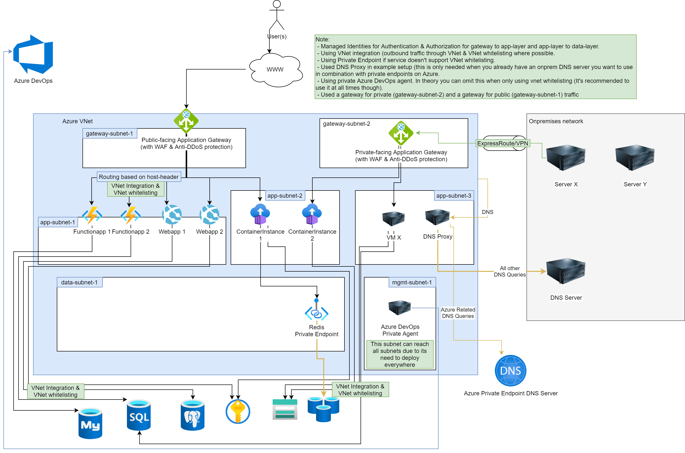

Key takeaways are:
 - Always use an application gateway to reach HTTPS resources in Azure. This also goes for on-premises to Azure connections. This component has [DDoS mitigation](https://en.wikipedia.org/wiki/DDoS_mitigation) and a [web application firewall](https://en.wikipedia.org/wiki/Web_application_firewall).
 - Always use managed identities (if possible. if not: use another way of auth) to handle authentication & authorization between layers & apps. This avoids apps calling the wrong data componenents etc.
 - Always use VNet integration in combination with [VNet whitelisting](#vnet-whitelisting) if possible. This is the recommended way of connecting apps within Azure. If this is not possible, use private endpoints and only if both the former are unavailable, start IP whitelisting.
 - Split your networklayers at least into the edge (gateway) layer, app layer & data layer. Feel free to add more layers where you see fit. This more or less still counts for the resources you use VNet whitelisting for. You dont want to place something in your gateway subnet which you whitelist on your database directly. Also make sure to use [Network Security Groups](https://docs.microsoft.com/en-us/azure/virtual-network/network-security-groups-overview) to only allow the network connections you need between the layers.
 
This example architecture has a few extra's which you might not want or need:
 - We added a DNS proxy. This is needed whenever you want to use private endpoints in Azure but already have an on-premises DNS server which you dont have control over. In case you have control over your on-premises DNS server, you want to configure it to having the Azure Private Endpoint DNS Server as it's upstream DNS server. There is however a limitation for this Azure Private Endpoint DNS server; You will need a (recursive) DNS proxy which redirects every DNS request to the azure [private endpoint dns](#dns) server from inside your VNet. This is due to the fact that the Azure Private Endpoint DNS Server only accepts DNS requests from inside the VNet itself.
 - We added an Azure DevOps private agent which does the deploying to your resources for you. This is to eliminate the necessary whitelist- & dewhitelist-actions for public ip's in your pipeline before you can deploy from a hosted agent. If you dont use this private agent, make sure you whitelist the hosted agent before deploying to the resources (deploy your app or files to storage for example), and remove them after you are done. The scripts needed for this are inside the CLI scripts (`Add-Network-Whitelist-for-<resourcename>.ps1` and `Remove-Network-Whitelist-for-<resourcename>.ps1`)
 - Next to the public gateway (which is shown in gateway-subnet-1 in the image above), we also added a private facing gateway which will be used to leverage the applications from on-premises. We decided we always want to have an application gateway in front of our app layer, which is compliant with the [zero trust architecture](#zero-trust-architecture).

# Which components are available & when to use them?
Currently we've focussed on the following:
- Some basic network components
- Edge layer --> Application Gateway
- App Layer --> App Services, Function Apps & RedisCache
- Data layer --> Storage Accounts, Multiple relational databases & Keyvault.
- Supporting tools --> Application Insights, Azure Monitor & Azure Log Analytics Workspace
- Some experimental components --> App Configuration & Container Instances

# Prerequisites
- An Azure DevOps instance (you are probably reading this inside one right now).
- One or more azure subscriptions

# Setup Azure DevOps & GIT
We are using a more-or-less complex GIT setup to fulfil our needs. The generic library you are watching right now should be sharable between companies at all times. This means that no company related data/rules should be implemented in this boilerplate. However, you probably have scripts & documentation which actually does contain logics or information of/for your company. To deal with this, we've created a 2-tier GIT repo. We created a company specific repo with this generic repo, in it, as a GIT submodule. This implies that commiting, pulling & pushing gets a little more complicated. To help you out, this paragraph should tell you how the workflow should work.

## Create a new Azure DevOps Project
We recommend creating an `Azure Documentation` teamproject in your Azure DevOps instance.

1. On the main page click the New Project button in the top right corner.


2. Fill in the name of the new project. We use `Azure Documentation` for this.


3. Create the project and you will be sent to it's landing page.


## Mirroring the upstream repo to your own Azure DevOps instance
First of all you need to mirror [the upstream github repo](https://github.com/RobHofmann/Azure.PlatformProvisioning) to your own Azure DevOps instance as a working repo. To do this, follow these steps:

1. Go to the `Repos` section of your TeamProject (in our case we created the teamproject Azure Documentation according to the [Create a new Azure DevOps Project](#create-a-new-azure-devops-project) section of this document).

2. Create a new repository.

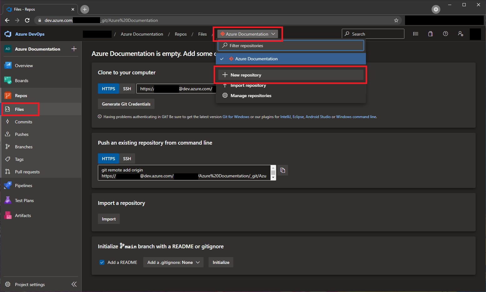

3. For the name fill in `Upstream.Azure.PlatformProvisioning`. Make sure to disable the `Add a README` option and put `Add a .gitignore` to `none`. Hit the `Create` button.


4. In the repo screen, make sure to have your `Upstream.Azure.PlatformProvisioning` repo selected. Hit the `Import` button

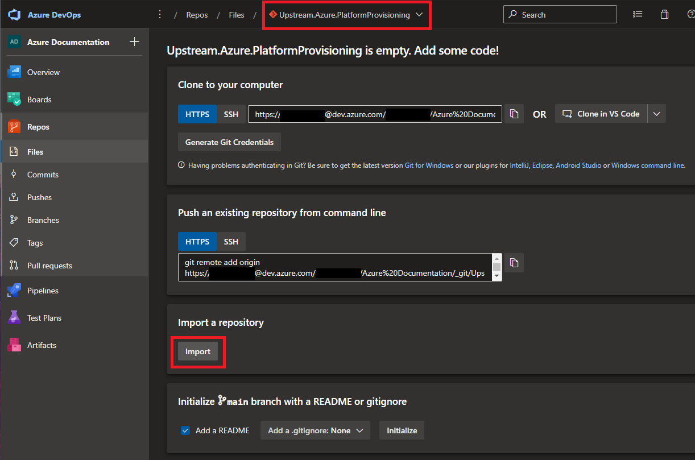

5. Import the `upstream` git repo from GitHub (Enter: https://github.com/RobHofmann/Azure.PlatformProvisioning.git).

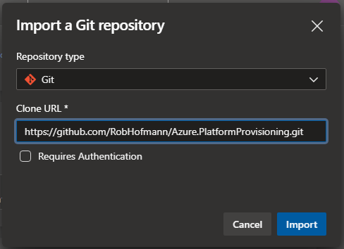

6. Give it a second to import the repo.

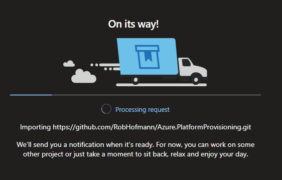

7. You will now have an imported repository.

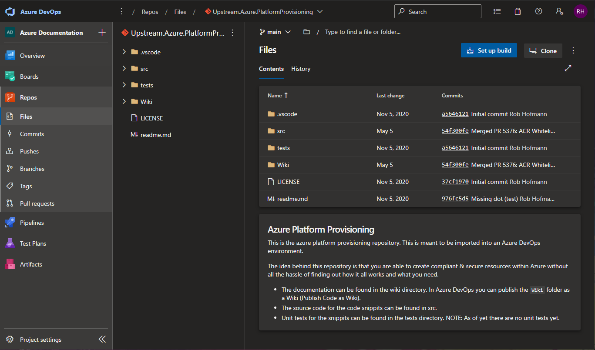

## Expose the docs as a wiki in your DevOps project
This project also includes documentation next to the scripts. Even better: the document you are reading right now is inside the documentation :). You can publish these docs as a Wiki inside your own Azure DevOps teamproject. Here's how to do it:

1. Go to your teamproject and navigate to `Overview` --> `Wiki`.


2. Next, click the `Publish code as Wiki` button.


3. Fill in the wiki information as shown on the screenshot below and hit the `Publish` button.


4. You will be redirected to your freshly exposed Wiki which you can now navigate!


## Recommended GIT structure / Company specific repository
As explained in [Setup Azure DevOps & GIT](#setup-azure-devops-%26-git) we have a setup with a company repo which holds this generic repo. We've done this to create 1 starting point for you and your colleagues to work with both company specific wiki's & scripts as well as the generic wiki & scripts. This is how the repository looks:


To create this repository the same way, follow these steps:

1. Create the new company specific repository next to the generic repo you already made in [Mirroring the upstream repo to your own Azure DevOps instance](#mirroring-the-upstream-repo-to-your-own-azure-devops-instance).

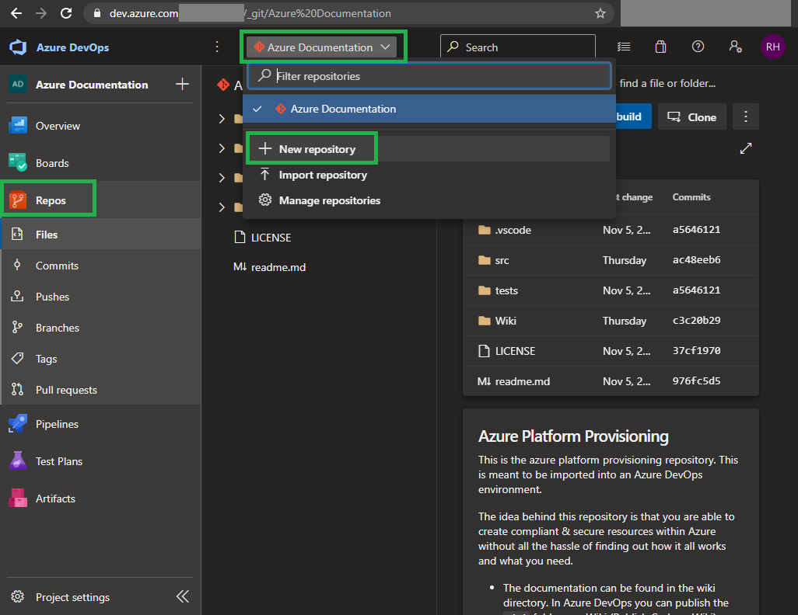

2. Fill in the information of your company repo (the name in the screenshot is fictional) and click on the `Create` button.

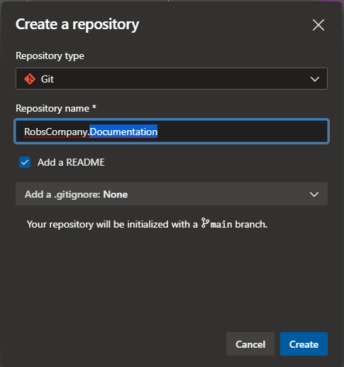

3. Get the company cloning address by clicking the `Clone` button in your freshly created repository.

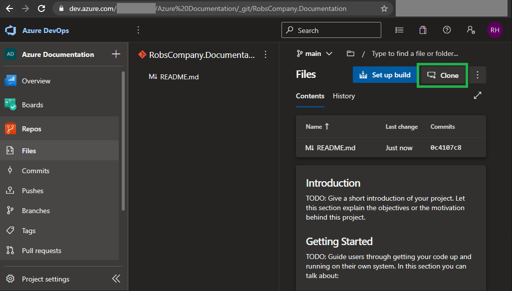

4. Copy the clone address by clicking the copy button.

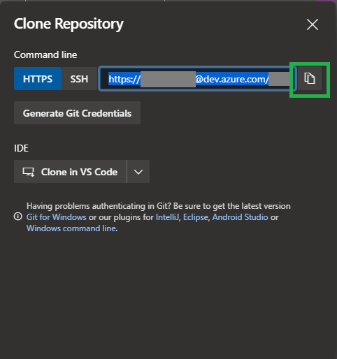

5. Open the terminal of your choice (We recommend using Windows Terminal) and navigate to the folder where you want to checkout this repo. Now clone the repo, CD into it, add the submodule & commit & push it back to the server using these commando's (make sure to substitute the variables before running the commands):

```batch
git clone <repo url>
cd <repo folder>
git submodule add <upstream repo url> Azure.PlatformProvisioning
git commit -a -m "Added sub repo"
git push origin main
```
> The upstream repo url is the URL made in the [Mirroring the upstream repo to your own Azure DevOps instance](#mirroring-the-upstream-repo-to-your-own-azure-devops-instance) step.

Congratulations. You now have created a company specific repository with the Generic repository as its submodule!

## Checking out the company specific repository on a new computer
Since your company specific repository has a submodule to the generic AzDocs, you need to do something special to check the whole structure out. You need to tell GIT to also clone the submodules on cloning your company specific repo. So instead of the usual:

`git clone <company specific repo url>`

you need to do:

`git clone --recurse-submodules <company specific repo url>`

> The URL of this repo is the URL to the repo created in this step: [Recommended GIT structure / Company specific repository](#recommended-git-structure-%2F-company-specific-repository)

Et voila! your full repository (or actually repositories) is/are now cloned!

## Working with this setup & GIT
Whenever you work with submodules and you edit something in these submodules (in this case the upstream repo), you need to update the reference in the company specific repo to the new commit of this generic (your copy of the upstream) repo. This is a pretty straightforward process, but it can be a little hard to figure out on your own.

First of all, lets assume you are using Visual Studio Code. This example will make use of VsCode so that we can make it visual:

1. Make your change in the generic repo. Let's assume you already have done this. In this example we changed the `Azure.md` file.

2. In VsCode when you opened the company specific repo with the submodule as a folder (File --> Open Folder), 


3. Under the `Source Control` tab you will see two repositories. Commit & Push the generic repo content (in our case the `Azure.md` file.). This is the bottom one in the following screenshot.

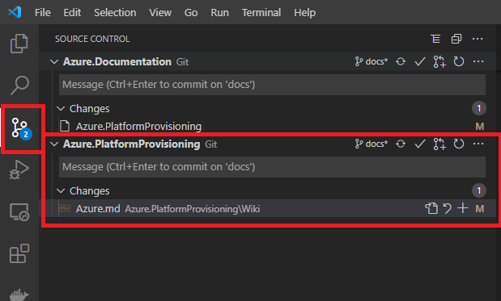

4. In the top repo you will see that the submodule file was changed (in the screenshot the file is called `Azure.PlatformProvisioning`). If you click on this change, you will see the following:

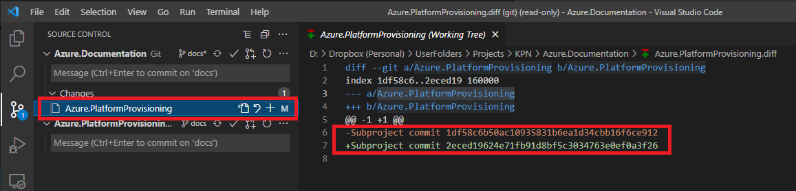

5. In the screenshot you see that the subproject commit id has changed. This is to reference the new version (commit) of your generic repository. Commit & Push this file to update your company specific repo. At this point, your automatic build-pipeline will start to run.

6. After the build-pipeline is done, you will have the new version of the AzDocs at your disposal.

## How to keep your repositories in sync with upstream
*For the next procedure you will need an account at GitHub. Make sure to have this before continuing. You can create a GitHub account [here](https://github.com/join).*

The generic repo will have 2 remote's if you also want to contribute to this project or get new updates from this project. So after mirroring [the upstream github repo](https://github.com/RobHofmann/Azure.PlatformProvisioning) to your own Azure DevOps instance, you want to clone the repository to your local machine.

> NOTE: Next to the working company repository with the generic repository inside (as explained in [the GIT paragraph](#git)) you daily use, we tend to keep the upstream in a separate folder on our computer aswell for syncing our origin with the upstream repo.

First clone the repo to your local disk with:

`git clone <upstream repo url>`

> The upstream repo url is the URL made in the [Mirroring the upstream repo to your own Azure DevOps instance](#mirroring-the-upstream-repo-to-your-own-azure-devops-instance) step.

After doing this you enter the freshly created repo folder and use this command to add the upstream remote to your local repo:

`git remote add upstream https://github.com/RobHofmann/Azure.PlatformProvisioning.git`

Doing so will give you two remotes: `origin` & `upstream`.

### Pulling new changes from upstream (Github) to your origin repo
*Make sure you followed the information from [How to keep your repositories in sync with upstream](#how-to-keep-your-repositories-in-sync-with-upstream) first.*

For this example lets assume that some work has been done by other companies and you want the latest & greatest changes for your company. Since our philosophy is that `upstream` should always be able to merge to `origin` we pull directly into our `origin/main` branch to avoid squash commits over and over between `upstream` & `origin`. Follow these steps to get the latest from `upstream` to your `origin`:

> First navigate to the cloned upstream repo (the repo made in the [Mirroring the upstream repo to your own Azure DevOps instance](#mirroring-the-upstream-repo-to-your-own-azure-devops-instance) step). Then follow these steps:

```batch
git checkout main
git pull upstream main
git push origin main
```

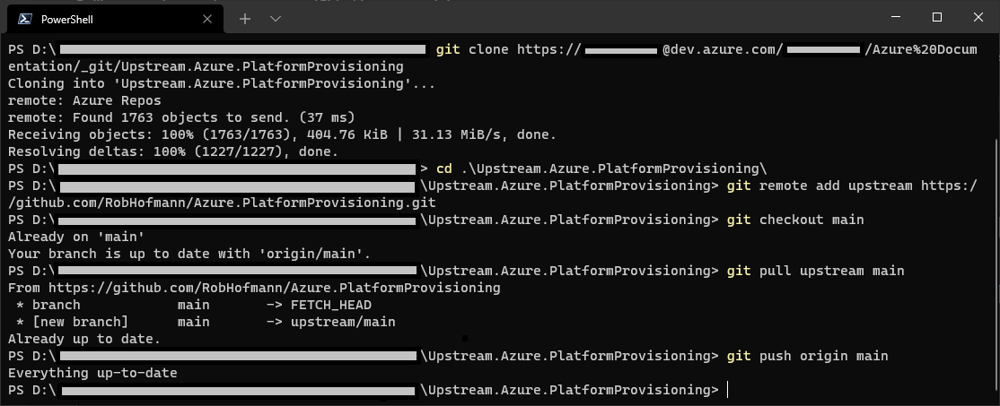

Your repository is now up to date.

### Commit the work you've done to the upstream (GitHub) repo
*Make sure you followed the information from [How to keep your repositories in sync with upstream](#how-to-keep-your-repositories-in-sync-with-upstream) first.*

Let's assume you've done some work on your `origin` and at some point in time you want to sync this back to the `upstream`. We do this by creating a new branch and pushing it to the upstream. We need to make sure we use the latest version of main to create our PR Branch from:

> First navigate to the cloned upstream repo (the repo made in the [Mirroring the upstream repo to your own Azure DevOps instance](#mirroring-the-upstream-repo-to-your-own-azure-devops-instance) step). Then follow these steps:

```batch
git checkout main
git pull origin main
git checkout -b 20210426
git push upstream 20210426
```

This will create a new branch in the upstream repo. After this you can [create a PR](https://github.com/RobHofmann/Azure.PlatformProvisioning/compare) on github. Select the branch you just created from the "compare" list.


Now confirm the selected branch by clicking the green `Create pull request` button.


Finally enter the name of your PR (I recommend naming it the same as the branch you created).

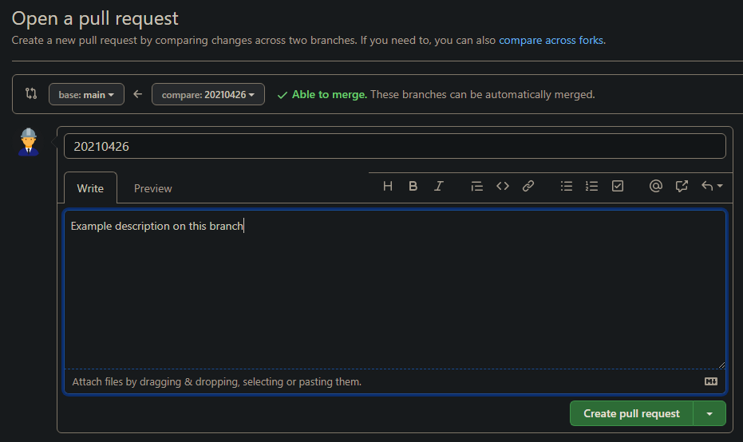

Done! From here multiple people will review this PR. Eventually the PR will be accepted or rejected based on the feedback & discussion. Make sure to reply to questions being asked & actively participate in the discussion revolving your PR.


*A merged pullrequest in the `upstream/main` branch*

# How to use the scripts
To use these scripts you simply add a Azure CLI step to your pipeline. Make sure to fill in the right subscription you want to use in the step and select the script from this repo you want to execute. If you are using classic release pipelines, we recommend making a taskgroup per script so you can re-use them easily.

## AzDocs Build
First of all you will need to "build" the scripts. This means you will need a build which gets the repo & submodule, copies the scripts to the `$(Build.ArtifactStagingDirectory)` and publishes the artifact to the internal Azure DevOps repo, so you can use it in your releases. We've provided the following YAML build to get this done.

1. Generate a new [Peronal Access Token](https://docs.microsoft.com/en-us/azure/devops/organizations/accounts/use-personal-access-tokens-to-authenticate?view=azure-devops&tabs=preview-page#create-a-pat).
2. [Base64 encode](https://www.base64encode.org/) the text `pat:<enterthePATfromstepone>`. For example: `pat:le5jjn4yskffufljovntjjjrtfzqyffvhec2b774a3zqauokbp4a` will give `cGF0OmxlNWpqbjR5c2tmZnVmbGpvdm50ampqcnRmenF5ZmZ2aGVjMmI3NzRhM3pxYXVva2JwNGE=`.
3. Find the repo url for your generic repository.


4. Go to pipelines and create a `New Pipeline` in the [Azure Documentations team project](#setup-azure-devops-%26-git).

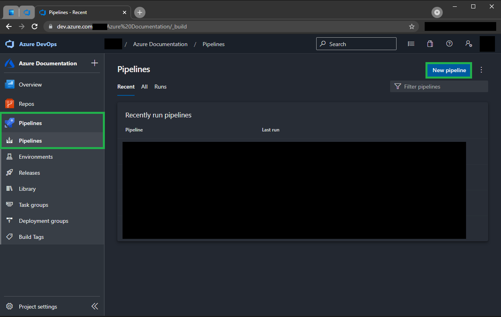

5. For your source, select `Azure Repos Git`.


6. Select your company specific repository (in the example our company repo is called `Azure.Documentation`).


7. Select Started Pipeline (this doesn't really matter, but you need to choose something).

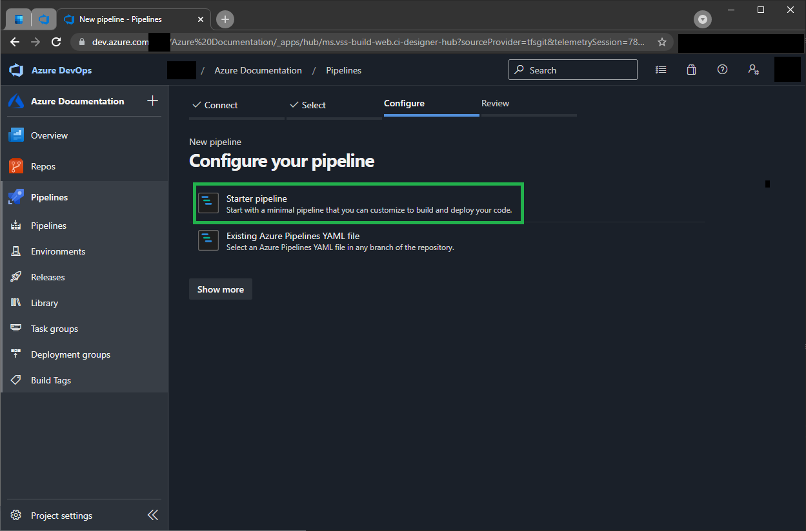

8. Replace the default YAML with following YAML in the pipeline:
```yaml
name: $(date:yyyy.MM.dd)$(rev:.r)-$(Build.SourceBranchName)
trigger:
  branches:
    include:
    - master
  paths:
    exclude:
    - azure-pipelines.yml

resources:
- repo: self

variables:
  # PLEASE ADD GIT_AUTH_HEADER TO YOUR PIPELINE VARIABLES AS A SECRET (SEE THE DOCS FOR MORE INFO)
  - name: UPSTREAM_REPO_URL
    value: <enter the generic repository url here>
  - name: DECODE_PERCENTS
    value: false

stages:
- stage: Build
  displayName: Create AzDocs Pipeline Artifact
  jobs:
  - job: Build
    displayName: Build
    pool:
      vmImage: ubuntu-latest
    steps:
    - task: Bash@3
      displayName: 'Get Submodule'
      inputs:
        targetType: 'inline'
        script: 'git -c http.$(UPSTREAM_REPO_URL).extraheader="AUTHORIZATION: basic $(GIT_AUTH_HEADER)" submodule update --init --recursive'
    # Generic Wiki
    - task: CopyFiles@2
      displayName: 'Copy Generic Wiki'
      inputs:
        SourceFolder: 'Azure.PlatformProvisioning/Wiki'
        TargetFolder: '$(Build.ArtifactStagingDirectory)/Wiki'
    # Company Specific Wiki
    - task: CopyFiles@2
      displayName: 'Copy Company Wiki'
      inputs:
        SourceFolder: 'Wiki'
        TargetFolder: '$(Build.ArtifactStagingDirectory)/Wiki'
    - task: PublishBuildArtifacts@1
      displayName: 'Publish AzDocs Artifact'
      inputs:
        PathtoPublish: '$(Build.ArtifactStagingDirectory)/Wiki'
        ArtifactName: 'azdocs-wiki'
        publishLocation: 'Container'
    # Generic src
    - task: CopyFiles@2
      displayName: 'Copy Generic src'
      inputs:
        SourceFolder: 'Azure.PlatformProvisioning/src'
        TargetFolder: '$(Build.ArtifactStagingDirectory)/src'
    # Company Specific src
    - task: CopyFiles@2
      displayName: 'Copy Company src'
      inputs:
        SourceFolder: 'src'
        TargetFolder: '$(Build.ArtifactStagingDirectory)/src'
    - task: PublishBuildArtifacts@1
      displayName: 'Publish AzDocs Artifact'
      inputs:
        PathtoPublish: '$(Build.ArtifactStagingDirectory)/src'
        ArtifactName: 'azdocs-src'
        publishLocation: 'Container'
```

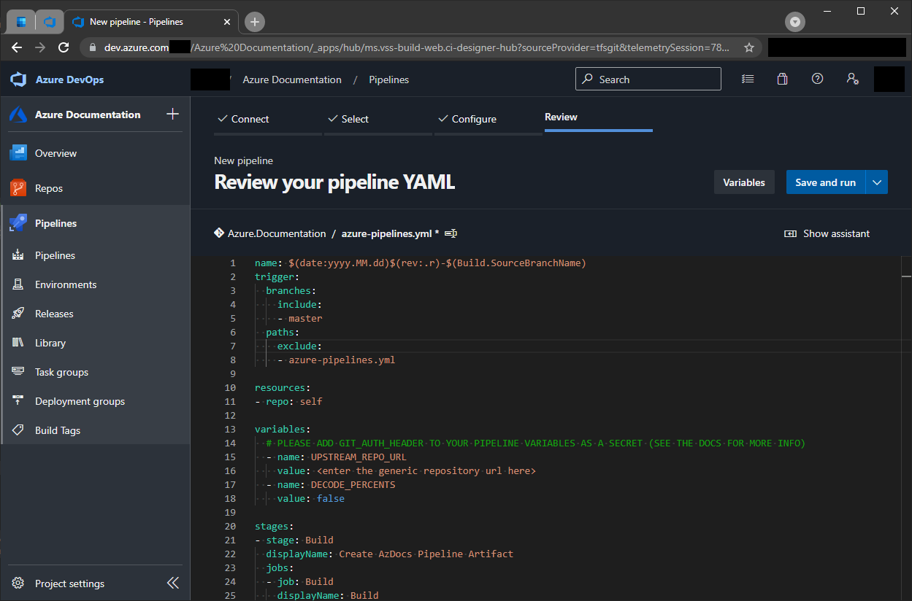

9. Click on `Variables` and add the `GIT_AUTH_HEADER` variable with with the `base64` value from step 2 (So `GIT_AUTH_HEADER=cGF0OmxlNWpqbjR5c2tmZnVmbGpvdm50ampqcnRmenF5ZmZ2aGVjMmI3NzRhM3pxYXVva2JwNGE=`) and mark the variable as `Secret`.


10. Click `New Variable`.

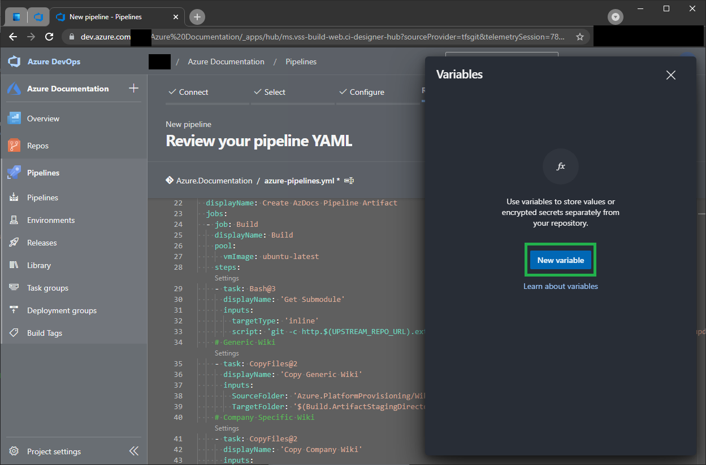

11. Enter `GIT_AUTH_HEADER` under the name and fill the value with the `base64` value from step 2 (So `GIT_AUTH_HEADER=cGF0OmxlNWpqbjR5c2tmZnVmbGpvdm50ampqcnRmenF5ZmZ2aGVjMmI3NzRhM3pxYXVva2JwNGE=`) and mark the variable as `Secret`. Click `Ok`.


12. Replace the `<enter the generic repository url here>` placeholder in the above YAML with the generic repo url from step 3.

13. Save & run the pipeline. Everything should turn green and you will have a build artifact!


## Adding the subscriptions to your teamproject
To deploy resources in Azure, you need to tell Azure DevOps how to reach the Azure subscription. [Click here](https://docs.microsoft.com/en-us/azure/devops/pipelines/library/connect-to-azure?view=azure-devops) to go to the official microsoft documentation on this to add this connection. We strongly recommend to name the connection identical to the subscription name.

## Classic Pipelines
*Make sure to have followed the steps in [AzDocs Build](#azdocs-build) and [Adding the subscriptions to your teamproject](#adding-the-subscriptions-to-your-teamproject)*

To create a release pipeline for your app where you can use this boilerplate, there are a few steps you have to do and a few steps which are recommended but not required. Here will be described how to create such a pipeline.
1. Go to the releases page in your teamproject and create a new release pipeline definition.
2. In the `Pipeline` tab, under `Artifacts`, add a new artifact and select the [AzDocs Build](#azdocs-build) (make sure to select the right Project first). It's recommended to assign the Source alias: `Azure.Documentation` to avoid weird characters in the file paths.
3. Add the optional build artifact for your own software.
4. Rename the `Stage 1` *stage*. Let't call it `dev` (later *stages* can be made, reproducing these steps but with `acc` or `prd` as the *Stage*-name.

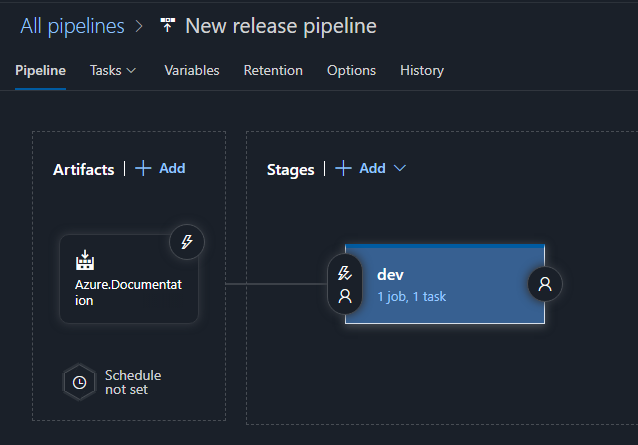

5. Click the `0 jobs, 0 tasks` link in the `dev` *stage*.
6. In the left column, click the `+` in the top right and search for the *Azure CLI* step.

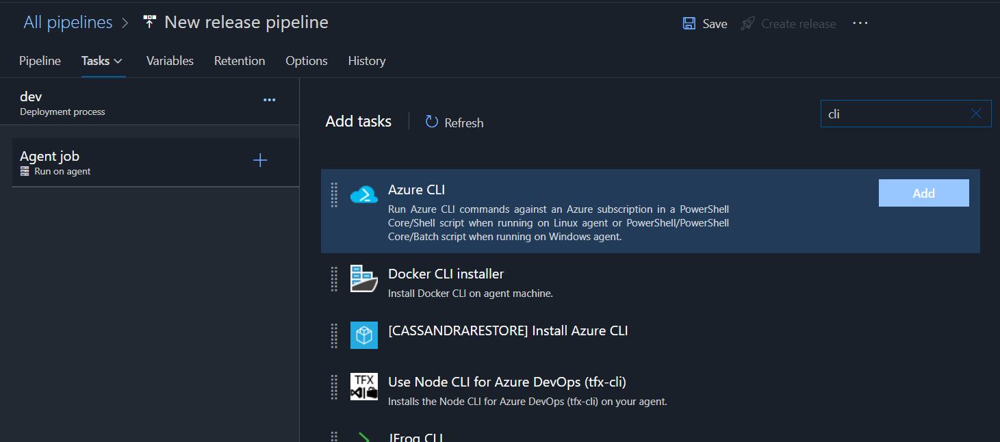

7. Enter these parameters in the *Azure CLI* step
    - Azure Resource Manager connection: *select the connection created in the [Adding the subscriptions to your teamproject](#adding-the-subscriptions-to-your-teamproject) step
    - Script Type: *PowerShell Core*
    - Script Location: *Script Path*
    - Script Path (replace with real values): `$(System.DefaultWorkingDirectory)/Azure.Documentation/drop/<ResourceType>/<Script>.ps1` (you can use the file browser to select your script)
    - Script Arguments: `<insert the needed script arguments from the script you are calling>`
    - Access service principal details in script: <input type="checkbox" checked> (Required in rare cases for some scripts).

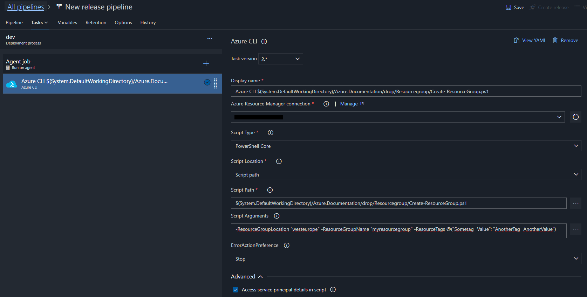

8. *Save* & *Create Release*. Congratulations, you can now run your pipeline and spin up secure & compliant Azure resources.

> NOTE: However, there are a few more tips & tricks we found useful. The following paragraphs containing tips & tricks are optional:

### Taskgroup all the things
For reusability purposes, it is wide to create a taskgroup for each script you use. This means you can add this taskgroup (even multiple times) to every pipeline you like without having to define the script location & parameters again. To create a taskgroup per script, follow the following tutorial:

1. Whenever you added the CLI step the first time, right click it and click on `Create task group`.


2. Give your taskgroup a fitting name (we choose to name the taskgroups identical to the scripts).


3. After creating the taskgroup, you can add a new step to your pipeline and search for your taskgroup (make sure to hit the `Refresh` button if you don't see your taskgroup in the list).

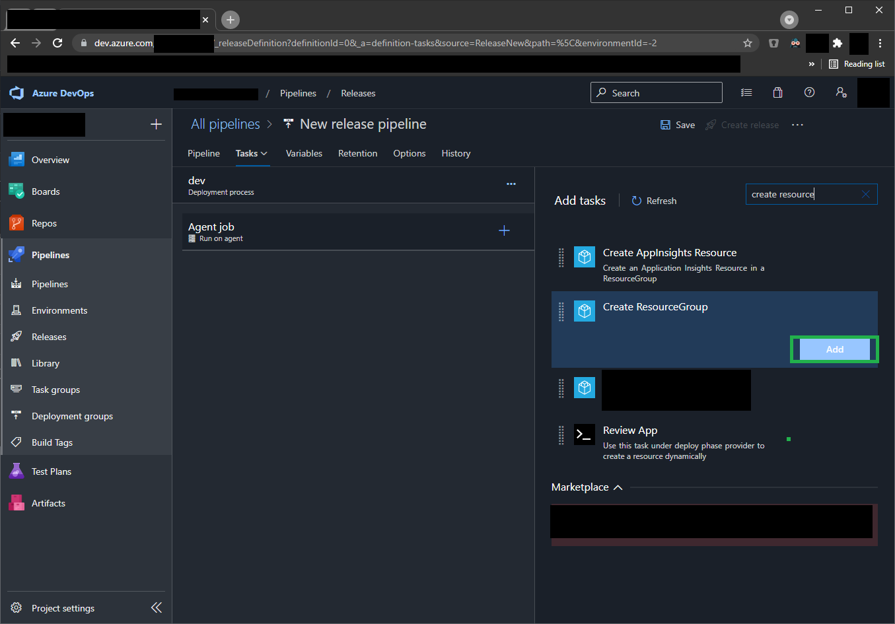

4. After you've added the taskgroup, you can fill in the variables with your desired values and run the pipeline.

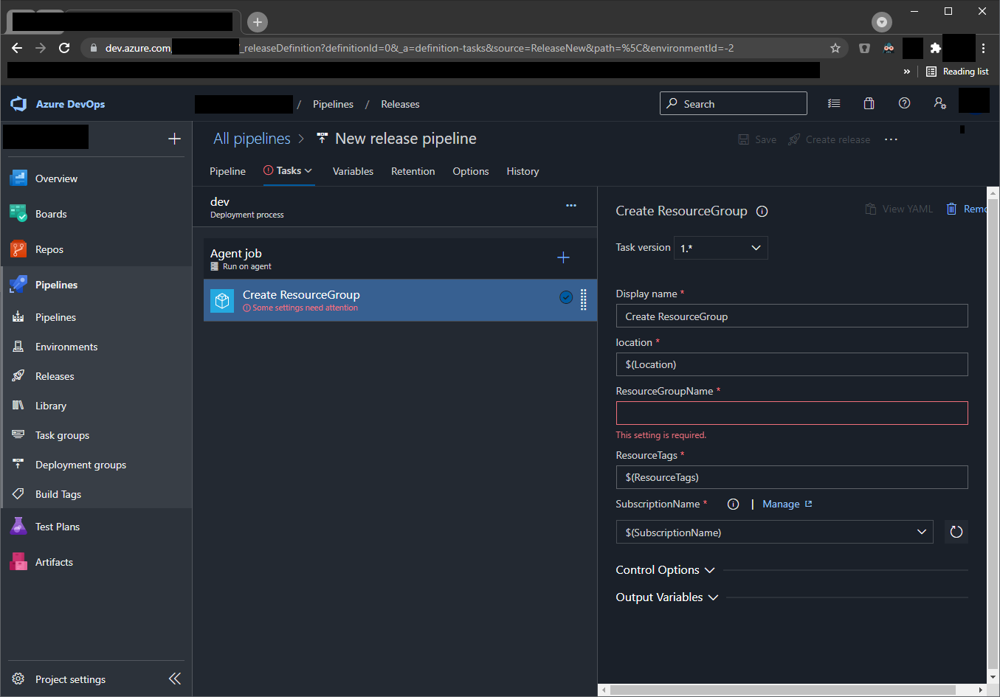


> NOTE: Known limitation: Taskgroups can not have output parameters. So for anything that uses output parameters, the step needs to be added to the pipeline directly and cannot be in any taskgroup. We strongly recommend to use YAML pipelines to not run into these issues.

### Taskgroup the pipeline itself
Classic Pipelines have the downside that you have to create your pipeline per environment. This can get nasty whenever you have a lot of environments or do a lot of changes on your pipeline. This is why we chose to "taskgroup the pipeline". The result is that you have 1 pipeline taskgroup which is added to each environment. Whenever you change your pipeline taskgroup, this goes for all your environments at once.

1. Go to your classic pipeline & edit it and go to your first environments pipeline (in this example it is `dev`).


2. Select all your tasks in the pipeline and rightclick --> `Create task group`


3. A new window will popup. We chose to name these taskgroups `[PIPELINE] <projectname>`. Now fill in the parameters. It is very likely that you can simply copy the parameter name and paste it as a variable (see screenshot below). This will just proxy your variables to the taskgroup.


4. You will now have a single taskgroup in your pipeline.


5. Switch to your other environment (in this example this is `acc`). Add the same taskgroup you just created to your pipeline.

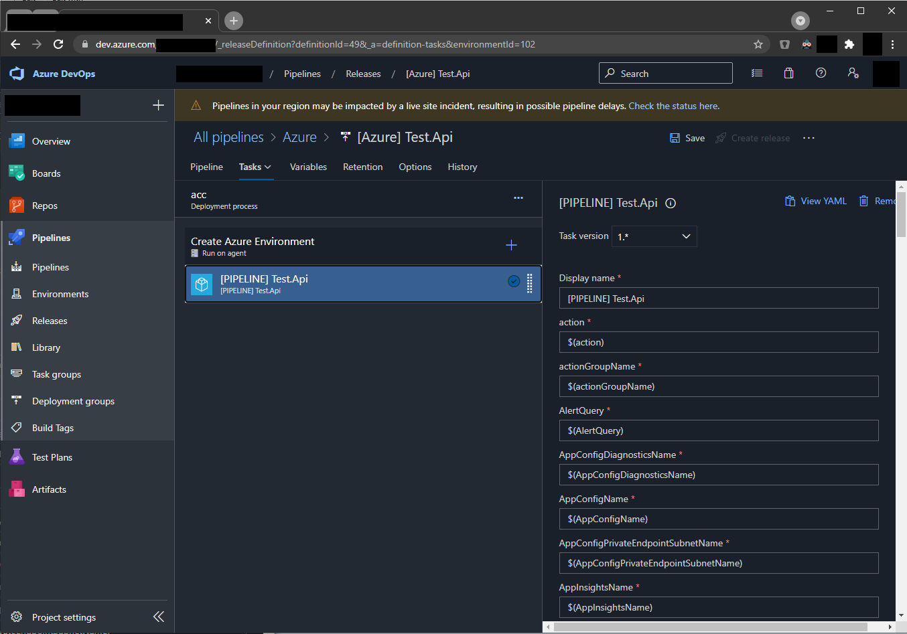

From now on. Whenever you change something inside your `[PIPELINE]` taskgroup, it will effect all your environments without having to keep track of all the pipeline changes between environments. This will force you into keeping your environments identical (which in our opinion is required for realistic testability).

### Variable groups
In contrast to YAML pipelines, we recommend using variable groups when using classic pipelines. This is so you can organize your variables between pipelines. For example if you have one central Log Analytics Workspace, you don't want 100 references to this resource. You can use a variable group to define the resource id and attach that variable group to all of your pipelines.

In YAML we recommend NOT doing this simply because of the "Infrastructure as Code" principle. This means that all the information needed for your pipeline should be in your repository & under sourcecontrol. Next to that; with YAML pipelines can you actually create pipelines per branch. In this case you can change/add/remove variables in that specific branch. This would not be possible if you use a variable group.

The only exception we make for using variable groups in YAML pipelines is when we are storing secrets. You dont want these in your repository due to security concerns :).

### Variable nesting
We recommend nesting variables and leveraging system variables. This means you will have a more standarized/consistent platform across your environments.
Below you can find an example where we define our Teamname & Projectname and re-use those, along with the `Release.EnvironmentName` systemvariable, to create our resourcegroup name. Note that in the example below the result for your `dev`, `acc`, and `prd` environments will be respectively: `AwesomeTeam-MyFirstProject-dev`, `AwesomeTeam-MyFirstProject-acc` and `AwesomeTeam-MyFirstProject-prd`.

This means you don't have to redefine the resourcegroupname for each environment and that if you, in a later stadium, choose to create a new environment, you dont have to go through your variables again. You can simply clone the environment, rename it & roll out the release.

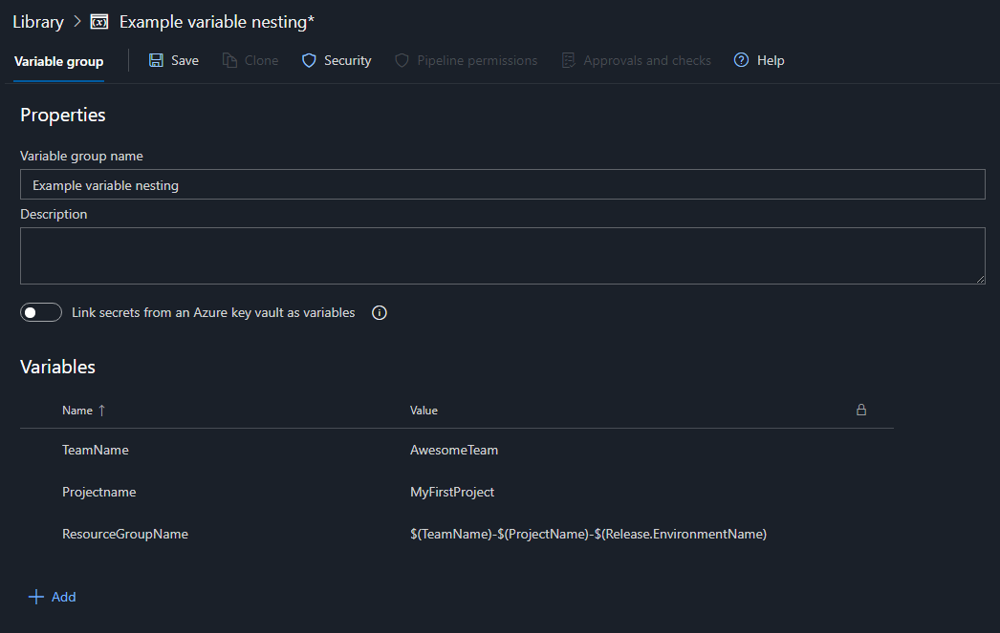

## YAML Pipelines
*Make sure to have followed the steps in [AzDocs Build](#azdocs-build) and [Adding the subscriptions to your teamproject](#adding-the-subscriptions-to-your-teamproject)*

The recommended way of building pipelines is using YAML pipelines. To make using this boilerplate convenient for you, we've added a few ways of using it in your projects.

First of all, and most important, in each wiki page for the scripts we've added a piece of YAML code which you can conveniently copy & paste into your own YAML pipelines. This means that adding resources to your pipeline is as simple as just copy & paste and fill in the variables!

Next to this we've also made a few examples on how to create a pipeline with two goals in mind:
 - Examples how to setup a pipeline in general which supports multiple environments without having to redefine your pipeline for each environment (to guarantee reproducibility in your platform across environments).
   - Generic/Bare Orchestrator Pipeline (this is the root file which is being imported in your pipelines) - `templates/Examples/General/pipeline-orchestrator.yml`
      - Generic/Bare Build template - `templates/General/pipeline-build.yml`
      - Generic/Bare Release template - `templates/Examples/General/pipeline-release.yml`
 - Examples for specific "often used" resources
   - [FunctionApp Orchestrator Pipeline (this is the root file which is being imported in your pipelines)](../templates/Examples/FunctionApp/pipeline-orchestrator.yml)
      - [FunctionApp Build template](../../templates/Examples/FunctionApp/pipeline-build.yml)
      - [FunctionApp Release template](../../../templates/Examples/FunctionApp/pipeline-release.yml)
   - [WebApp Orchestrator Pipeline (this is the root file which is being imported in your pipelines)](templates/Examples/WebApp/pipeline-orchestrator.yml)
      - [WebApp Build template](../templates/Examples/WebApp/pipeline-build.yml)
      - [WebApp Release template](../templates/Examples/WebApp/pipeline-release.yml)

# Guidelines for creating new scripts
If you want to create new scripts and PR them into this repo, make sure to follow the [Azure CLI unless](#azure-cli-unless) rule. We make use of creating [powershell advanced functions](https://docs.microsoft.com/en-us/powershell/module/microsoft.powershell.core/about/about_functions_advanced?view=powershell-7.1). A general advise is to take a look at other scripts and copy those and go from there.

The start of every script should look something like this:
```powershell
[CmdletBinding()]
param (
    [Parameter(Mandatory)][string] $FictionalParameter,    
)

#region ===BEGIN IMPORTS===
Import-Module "$PSScriptRoot\..\AzDocs.Common" -Force
#endregion ===END IMPORTS===

Write-Header -ScopedPSCmdlet $PSCmdlet
```
and the end should look something like this:
```powershell
Write-Footer -ScopedPSCmdlet $PSCmdlet
```

## Coding Convention
We use the `Allman` code formatting preset from VSCode. Also we disable the `openBraceOnSameLine` setting in powershell. In theory your VSCode should already do this for you, since we've checked in our [settings.json](../.vscode/settings.json) to the repository.

### Naming
- Our script & function parameters are written CamelCase
- Local variables are all lowercase
- Functionnames are written CamelCase
- Names should be logical, recognizable and should avoid confusion
- We try to follow the [Noun-verb](https://docs.microsoft.com/en-us/powershell/scripting/developer/cmdlet/approved-verbs-for-windows-powershell-commands?view=powershell-7.1) naming for functions

# Application Gateway
When we started this documentation, we promised eachother to not write anything about individual components. However, since we've chosen to only use the Application Gateway (AppGw) as our edge layer component, we decided it is a good idea to say something revolving this component and it's complexity (and our automation in this). Creating an AppGw is easy, but mastering one is a little harder. We've chosen to create our own SSL Policies for our AppGw's and to automate the hell out of this component due to its complexity (see [the create entrypoint script](../src/AzDocs.Common/public/AppGateway-Helper-Functions.ps1) if you want to know what i'm talking about).

## Creating an Application Gateway
Creating an application gateway is easy. Simply use the [Create Application Gateway](/Azure/Azure-CLI-Snippets/Application-Gateway/Create-Application-Gateway) script to create the App Gateway.

OPTIONAL: Enable DDoS protection to your VNet (the script can be found in the Networking folder). NOTE: This costs ~4k USD.

## SSL Policy
The next thing you want to do is setup secure SSL policies. By default the Gateway will support TLS 1.2 with a set of ciphers (predefined profile AppGwSslPolicy20170401S). We've found that this default set of ciphers isn't the strongest option available. We've set our Gateway to the following:

Minimal TLS Version: `1.2`

Ciphers in order:
- `TLS_ECDHE_ECDSA_WITH_AES_256_GCM_SHA384` <-- Strong
- `TLS_ECDHE_ECDSA_WITH_AES_128_GCM_SHA256` <-- Strong
- `TLS_ECDHE_RSA_WITH_AES_256_GCM_SHA384` <-- Strong
- `TLS_ECDHE_RSA_WITH_AES_128_GCM_SHA256` <-- Strong
- `TLS_DHE_RSA_WITH_AES_256_GCM_SHA384` <-- Strong
- `TLS_DHE_RSA_WITH_AES_128_GCM_SHA256` <-- Strong
- `TLS_RSA_WITH_AES_256_GCM_SHA384` <-- Fallback. Strong enough, but mainly for backwards compatibility
- `TLS_RSA_WITH_AES_128_GCM_SHA256` <-- Fallback. Strong enough, but mainly for backwards compatibility

The strong ciphers are supported by mainly all devices since 2014.

If you are still using Windows Server 2012 R2 machines, follow [this link](https://docs.microsoft.com/nl-nl/mem/configmgr/core/plan-design/security/enable-tls-1-2-client) to make TLS 1.2 work with this OS. To be able to reach Azure through the application gateways, you will need to add support for TLS 1.2 to Windows Server 2012 R2 machines.

## Creating Entrypoints
Creating entrypoints can be done using [Create Application Gateway Entrypoint for ContainerInstance](/Azure/Azure-CLI-Snippets/Application-Gateway/Create-Application-Gateway-Entrypoint-for-ContainerInstance) (Azure Container Instances) or [Create Application Gateway Entrypoint for DomainName](/Azure/Azure-CLI-Snippets/Application-Gateway/Create-Application-Gateway-Entrypoint-for-DomainName) (AppServices, FunctionApps). These scripts will more or less do the following for you:
- Handle naming for you based on the ingress domain name you are using
- Handle permissions, identities, authentication & authorization between the Application Gateway & Keyvault
- Handle the certificate (uploading in keyvault,  linking to the application gateway & setting it in your HTTPS listener)
- Update the certificate if you pass a renewed certificate in the keyvault, AppGw & HTTPS listener
- Create the following components for you (again automatically named based on the ingress domainname): Backendpool, Healthprobe, HTTP Setting, HTTPS Listener, routing rules a HTTP listener with autoredirect to HTTPS.
- The script will make sure everything is setup correctly & that your backend is reachable with a healthcheck. Your pipeline will fail if the backend is not reachable.

# Networking
There are different ways of doing networking within Azure. By default resources will either be public or have an IP Whitelist. By design we don't want to use public resources or use IP whitelists because of the potential insecurities in this. We made the choice to use two different ways of supporting connectivity; VNet whitelisting & Private Endpoint.
The general rule of thumb should be to use VNet whitelisting where applicable. If thats not possible we use private endpoints. If that is unavailable aswell, we fallback to public access with plain IP whitelists.
Another rule of thumb is to keep in mind that we don't want to use methods of vnet connectivity where we have to sacrifice a whole subnet due to a delegation (vnet integration for appservices have this problem) unless there is no other way. The reason for this is that this costs a lot of private IP's. If you have a tight private IP space, don't waste them on delegations :).

## VNet whitelisting
As mentioned, VNet whitelisting is the desired way of connecting your resources within Azure. The description we'd like to use is that VNet whitelisting means you allow a subnet in your VNet to connect to your Azure resource. Microsoft does some nice public/private network translation magic for this. The benefit is that you can choose any vnet/subnet combination to be whitelisted without the vnets actually [peered](https://docs.microsoft.com/en-US/azure/virtual-network/virtual-network-peering-overview), where private endpoints will limit you to stuff which is in the same vnet as the private endpoint. Technically this means that your public endpoint will be enabled. However Microsoft allows you to define which private resources (resources from within a vnet) can reach this public endpoint. By default this method will block all public traffic to the Azure resource, which is desired in our eyes.

## Private Endpoints
We see [private endpoints](https://docs.microsoft.com/en-US/azure/private-link/private-endpoint-overview) as a fallback scenario for resources that do not support VNet whitelisting. Also this is the main way of connecting from on-premises to Azure resources. The idea behind private endpoint is that your Azure Resource will get a "leg" for incoming traffic in a subnet within your vnet. Also microsoft offers the option for the DNS entry of your resource to be changed from the public resource IP to the private endpoint ip.

Example:
If you have a SQL server with the name `testserver`, you will get a DNS record out of the box which looks like `testserver.database.windows.net` which resolves to a public ip, lets say `50.20.30.40`. It means that whenever you connect to your SQL Database you will set the connectionstring to `testserver.database.windows.net` and your application will resolve this to `50.20.30.40`.
Whenever we enable the private endpoint feature, microsoft will actually create a new DNS record `testserver.privatelink.database.windows.net` with your private ip, lets say `10.0.0.5`. The next step Microsoft does for you, is that within your VNet context the "public" DNS entry `testserver.database.windows.net` will resolve to a CNAME `testserver.privatelink.database.windows.net` which in its turn resolves to `10.0.0.5`. So within your VNet you will start connecting on a private IP, which allows you to completely disable the public endpoint if desired. If you resolve `testserver.database.windows.net` from outside your VNet, it will keep resolving to `50.20.30.40` (since you don't have connectivity to the private endpoint there).

> NOTE: One of the funny things we noticed is that for AppServices & functions in particular, whenever you add a private endpoint you are unable to get public access working even adding public ip's to your whitelist. You can fix this by using an [Application Gateway](https://docs.microsoft.com/en-US/azure/application-gateway/overview) in front of this App Service/FunctionApp with private endpoint.

### DNS
Whenever you want to use private endpoint there is a few things to know. The first of these things is that you will need a non-default DNS server to resolve your private endpoint DNS entries. The default DNS server from Azure will keep returning the public IP, which is undesired for your private endpoint situation. This means that you will need to define the "private endpoint dns server" in your Virtual Network as being the DNS server to use. The address to resolve your privatelink DNS entries from is `168.63.129.16`.

> OPTIONAL: If you do not want to set this DNS server for the whole VNet, there are ways to set this on a resourcelevel. For example adding `WEBSITE_DNS_SERVER=168.63.129.16` to your [application settings](https://docs.microsoft.com/en-us/azure/app-service/configure-common) in your App Service does this.

### Route your traffic through the VNet
Another thing to know when you use private endpoints, in combination with the Azure Private DNS, is that you need to make sure your resources will route all traffic through the VNet. For example: you need to add an [application setting](https://docs.microsoft.com/en-us/azure/app-service/configure-common) to your AppService that defines that you route this traffic through your VNet integration towards the VNet. For AppServices you can do this adding `WEBSITE_VNET_ROUTE_ALL=1` to your application settings (this is done by the AzDocs create webapp scripts for you). This setting will route all outbound traffic through your VNet. For more information, refer to [the microsoft documentation for vnet integration](https://docs.microsoft.com/en-us/azure/app-service/web-sites-integrate-with-vnet)

> NOTE: If you are using a recursive DNS server within your VNet in Azure which is on an addressrange defined in the RFC1918 specification, you don't need to explicitly route all traffic through your VNet.

### How to deploy to private resources: Azure DevOps Private Agents
A challenge you will be facing when you use private endpoints, is that your Azure DevOps hosted agents are unable to connect to your (now) private resource. This means that, for example, an application deploy to an appservice or adding a file to your storage account will fail. This means that you will have to host a private Azure DevOps agent inside your VNet to connect through the private endpoints. 

## On-premises networks
There are several ways of connecting your resources in azure from & to on-premises resources:
- Azure ExpressRoute
- Site-to-site VPN using the Virtual Network Gateway
- Hybrid connections

Currently this stack has been tested using the ExpressRoute & the Virtual Network Gateway.

When connecting your Azure platform to your onpremises network, make sure that you DO NOT have any overlapping IP's.

We use two flavours of connecting from on-premises resources to Azure:
 - HTTPS traffic --> We make sure to put an Application Gateway in front of the HTTP resource and connect the onprem resources via this Application Gateway.
 - Other resources like SQL databases, storage account, redis cache etc --> You will need to create a private endpoint for your Azure Resource which will be used to connect to from on-premises. This means that your on-premises datacenter has to understand that the DNS entry for those resources don't resolve to the public ip of the azure resource, but the private ip of the private endpoint.

### DNS
> NOTE: This part of the documentation is still under construction. We want to offer a 1-click-solution for the DNS servers.

<font color="red">TODO: Dit stukje klopt nog niet. Je hebt meerdere DNS servers dus je kunt niet verwijzen vanuit onprem</font>

Whenever you use an on-premises DNS server in combination with private endpoints there is a challenge to overcome: When do you resolve DNS entries from onpremises and when from the private endpoint DNS server from Azure itself?
The solution we found that worked best is to create a recursive dns server (a DNS proxy which does the querying for you instead of redirecting your DNS query to the target server). The reason why you want the DNS proxy to do the query itself is because if your resource lives on-premises and you do the DNS request from there, the Azure Private Endpoint DNS Server will return the public IP, since it sees you are NOT within the VNet. This will result in connection not being able to be made.
The technical implementation we have been using is to use bind9 as a DNS server with the following script:
```sh
#!/bin/sh
#
#  only doing all the sudos as cloud-init doesn't run as root, likely better to use Azure VM Extensions
#
#  $1 is the forwarder, $2 is the vnet IP range, $3 is the first dns, $4 is the second dns
#

touch /tmp/forwarderSetup_start
echo "$@" > /tmp/forwarderSetup_params

#  Install Bind9
#  https://www.digitalocean.com/community/tutorials/how-to-configure-bind-as-a-caching-or-forwarding-dns-server-on-ubuntu-14-04
echo 'debconf debconf/frontend select Noninteractive' | sudo debconf-set-selections
sudo apt-get update -y
sudo apt-get install bind9 -y

# configure Bind9 for forwarding
sudo cat > named.conf.options << EndOFNamedConfOptions
acl goodclients {
    $2;
    localhost;
    localnets;
};


options {
        directory "/var/cache/bind";

        recursion yes;

        allow-query { goodclients; };

        forwarders {
            $3;
            $4;
        };
        forward only;

        #dnssec-validation auto;

        auth-nxdomain no;    # conform to RFC1035
        listen-on { any; };
};

zone "azconfig.io" IN {
    type forward;
    forwarders {
        $1;
    };
};
zone "azmk8s.io" IN {
    type forward;
    forwarders {
        $1;
    };
};
zone "azure.com" IN {
    type forward;
    forwarders {
        $1;
    };
};
zone "azure.net" IN {
    type forward;
    forwarders {
        $1;
    };
};
zone "azure-api.net" IN {
    type forward;
    forwarders {
        $1;
    };
};
zone "azure-automation.net" IN {
    type forward;
    forwarders {
        $1;
    };
};
zone "azurecontainer.io" IN {
    type forward;
    forwarders {
        $1;
    };
};
zone "azurecr.io" IN {
    type forward;
    forwarders {
        $1;
    };
};
zone "azure-devices.net" IN {
    type forward;
    forwarders {
        $1;
    };
};
zone "azureedge.net" IN {
    type forward;
    forwarders {
        $1;
    };
};
zone "azurefd.net" IN {
    type forward;
    forwarders {
        $1;
    };
};
zone "azureml.ms" IN {
    type forward;
    forwarders {
        $1;
    };
};
zone "azure-mobile.net" IN {
    type forward;
    forwarders {
        $1;
    };
};
zone "azurewebsites.net" IN {
    type forward;
    forwarders {
        $1;
    };
};
zone "cloudapp.net" IN {
    type forward;
    forwarders {
        $1;
    };
};
zone "msecnd.net" IN {
    type forward;
    forwarders {
        $1;
    };
};
zone "onmicrosoft.com" IN {
    type forward;
    forwarders {
        $1;
    };
};
zone "signalr.net" IN {
    type forward;
    forwarders {
        $1;
    };
};
zone "trafficmanager.net" IN {
    type forward;
    forwarders {
        $1;
    };
};
zone "visualstudio.com" IN {
    type forward;
    forwarders {
        $1;
    };
};
zone "windows.net" IN {
    type forward;
    forwarders {
        $1;
    };
};
zone "windowsazure.com" IN {
    type forward;
    forwarders {
        $1;
    };
};

EndOFNamedConfOptions

sudo cp named.conf.options /etc/bind
sudo service bind9 restart

sudo apt-get upgrade -y
```

# Logging
We are using Log Analytics Workspace (LAW) as our main logging solution. We strive to send all the logs we have to a central LAW instance (one LAW for each `DTAP` stage). You will see `az monitor diagnostic-settings create` commands in several scripts to send diagnostics to the LAW's aswell. Next to that we use [Serilog](https://serilog.net/) in our .NET Stacks with the [Serilog Azure Analytics sink](https://github.com/saleem-mirza/serilog-sinks-azure-analytics) for logging our application logs to the LAW.

To provision the logging settings from your pipeline, use these appsettings for your function/appservice (make sure to replace the values accordingly):
```
"Serilog__MinimumLevel=Debug"; "Serilog__WriteTo__1__Name=AzureAnalytics"; "Serilog__WriteTo__1__Args__logName=TheNameOfTheLogYouWant"; "Serilog__WriteTo__1__Args__workspaceId=LogAnalyticsWorkspaceGuid"; "Serilog__WriteTo__1__Args__authenticationId=LogAnalyticsPrimaryKey"; "Serilog__WriteTo__2__Args__restrictedToMinimumLevel=Information"; "Serilog__WriteTo__2__Args__telemetryConverter=Serilog.Sinks.ApplicationInsights.Sinks.ApplicationInsights.TelemetryConverters.TraceTelemetryConverter, Serilog.Sinks.ApplicationInsights"; "Serilog__WriteTo__2__Name=ApplicationInsights"; "Serilog__Using__2=Serilog.Sinks.ApplicationInsights"; "Serilog__Using__1=Serilog.Sinks.AzureAnalytics";
```

TODO

# Monitoring
TODO

# Deprovisioning & clearing unintended whitelists
TODO

# Identities (Managed)
TODO