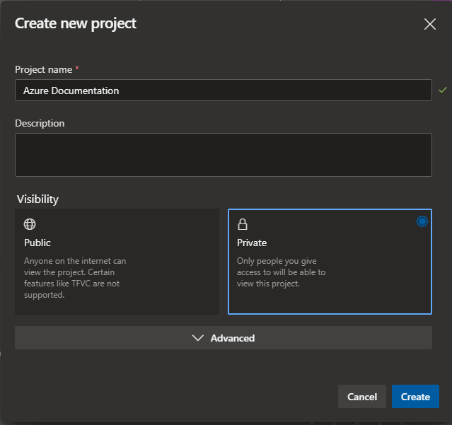
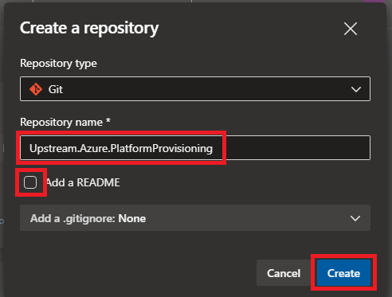
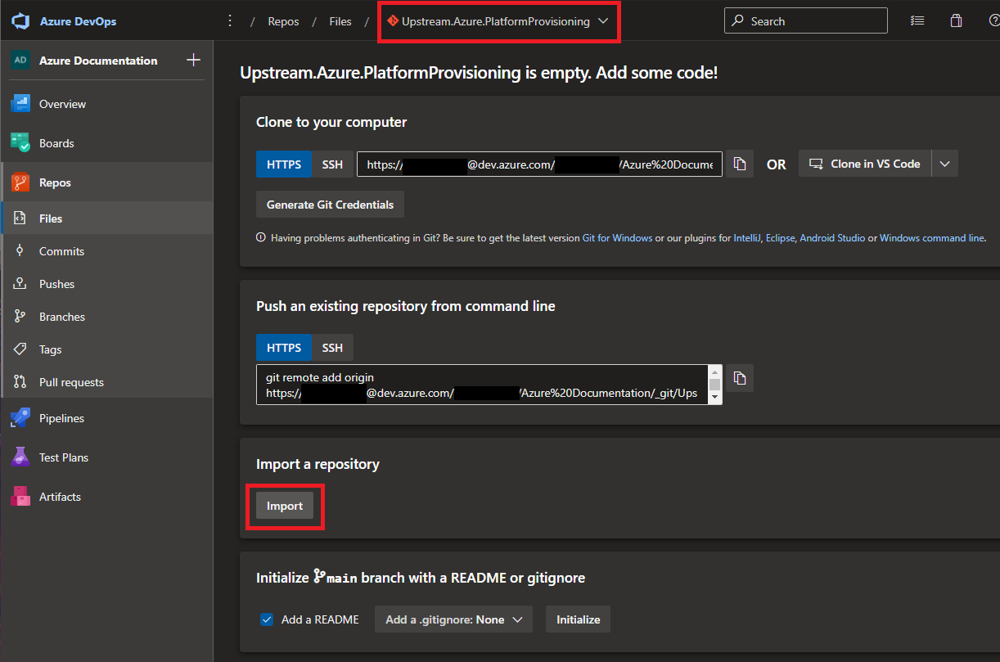
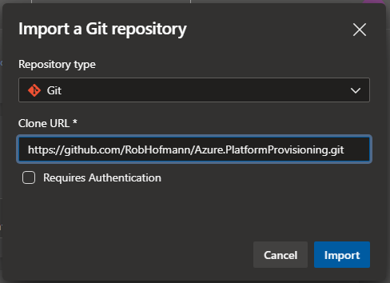
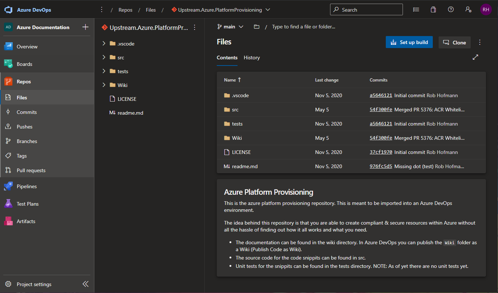
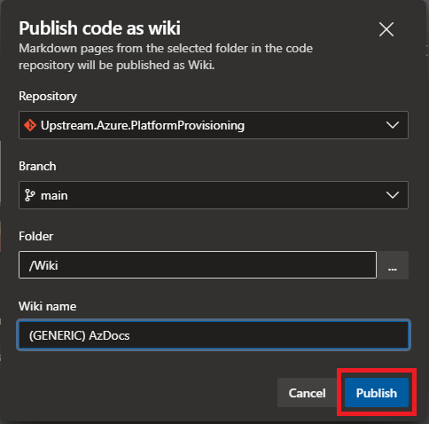
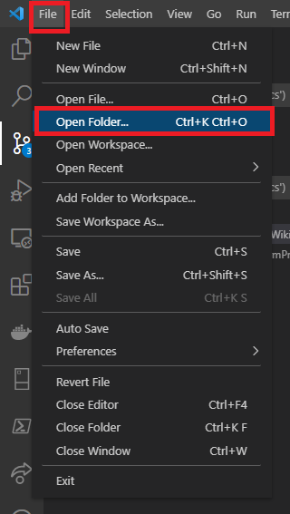
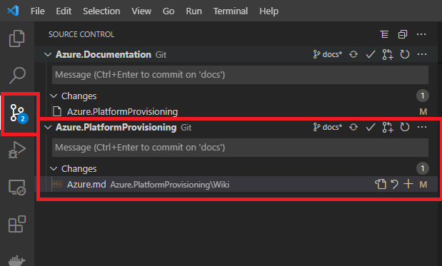
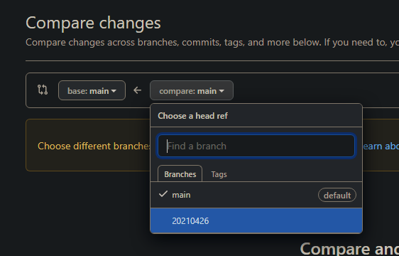

[[_TOC_]]

# Setup Azure DevOps & GIT

We are using a more-or-less complex GIT setup to fulfil our needs. The generic library you are watching right now should be sharable between companies at all times. This means that no company related data/rules should be implemented in this boilerplate. However, you probably have scripts & documentation which actually does contain logics or information of/for your company. To deal with this, we've created a 2-tier GIT repo. We created a company specific repo with this generic repo, in it, as a GIT submodule. This implies that commiting, pulling & pushing gets a little more complicated. To help you out, this paragraph should tell you how the workflow should work.

So in short:

- Generic scripts which can be shared between companies --> Upstream/Generic repository
- Company specific scripts which can't/shouldn't be shared --> Your company repository

## Create a new Azure DevOps Project

We recommend creating an `Azure Documentation` teamproject in your Azure DevOps instance.

1. On the main page click the New Project button in the top right corner.


2. Fill in the name of the new project. We use `Azure Documentation` for this.



3. Create the project and you will be sent to it's landing page.


## Mirroring the upstream repo to your own Azure DevOps instance

First of all you need to mirror [the upstream github repo](https://github.com/AzDocs/AzDocs) to your own Azure DevOps instance as a working repo. To do this, follow these steps:

1. Go to the `Repos` section of your TeamProject (in our case we created the teamproject Azure Documentation according to the [Create a new Azure DevOps Project](#create-a-new-azure-devops-project) section of this document).

2. Create a new repository.


3. For the name fill in `Upstream.Azure.PlatformProvisioning`. Make sure to disable the `Add a README` option and put `Add a .gitignore` to `none`. Hit the `Create` button.



4. In the repo screen, make sure to have your `Upstream.Azure.PlatformProvisioning` repo selected. Hit the `Import` button



5. Import the `upstream` git repo from GitHub (Enter: https://github.com/AzDocs/AzDocs.git).



6. Give it a second to import the repo.


7. You will now have an imported repository.



## Expose the docs as a wiki in your DevOps project

This project also includes documentation next to the scripts. Even better: the document you are reading right now is inside this documentation :). You can publish these docs as a Wiki inside your own Azure DevOps teamproject. Here's how to do it:

1. Go to your teamproject and navigate to `Overview` --> `Wiki`.


2. Next, click the `Publish code as Wiki` button.


3. Fill in the wiki information as shown on the screenshot below and hit the `Publish` button. The wiki is inside the `Generic repository`.



4. You will be redirected to your freshly exposed Wiki which you can now navigate!


## Recommended GIT structure / Company specific repository

As explained in [Setup Azure DevOps & GIT](#setup-azure-devops-%26-git) we have a setup with a company repo which holds this generic repo. We've done this to create 1 starting point for you and your colleagues to work with both company specific wiki's & scripts as well as the generic wiki & scripts. This is how the repository looks:


To create this repository the same way, follow these steps:

1. Create the new company specific repository next to the generic repo you already made in [Mirroring the upstream repo to your own Azure DevOps instance](#mirroring-the-upstream-repo-to-your-own-azure-devops-instance).


2. Fill in the information of your company repo (the name in the screenshot is fictional) and click on the `Create` button.


3. Create two folders in the root of your company specific repo called `src` and `Wiki`. These folders will be used for your Company specific scripts & matching Wiki pages.

4. Get the company cloning address by clicking the `Clone` button in your freshly created repository.


5. Copy the clone address by clicking the copy button.


6. Open the terminal of your choice (We recommend using Windows Terminal) and navigate to the folder where you want to checkout this repo. Now clone the repo, CD into it, add the submodule & commit & push it back to the server using these commando's (make sure to substitute the variables before running the commands):

```batch
git clone <repo url>
cd <repo folder>
git submodule add <upstream repo url> Azure.PlatformProvisioning
git commit -a -m "Added sub repo"
git push origin main
```

> The upstream repo url is the URL made in the [Mirroring the upstream repo to your own Azure DevOps instance](#mirroring-the-upstream-repo-to-your-own-azure-devops-instance) step.

Congratulations. You now have created a company specific repository with the Generic repository as its submodule!

## Checking out the company specific repository on a new computer

Since your company specific repository has a submodule to the generic AzDocs, you need to do something special to check the whole structure out. You need to tell GIT to also clone the submodules on cloning your company specific repo. So instead of the usual:

`git clone <company specific repo url>`

you need to do:

`git clone --recurse-submodules <company specific repo url>`

> The URL of this repo is the URL to the repo created in this step: [Recommended GIT structure / Company specific repository](#recommended-git-structure-%2F-company-specific-repository)

Et voila! your full repository (or actually repositories) is/are now cloned!

## Working with this setup & GIT

Whenever you work with submodules and you edit something in these submodules (in this case the upstream repo), you need to update the reference in the company specific repo to the new commit of this generic (your copy of the upstream) repo. This is a pretty straightforward process, but it can be a little hard to figure out on your own.

First of all, lets assume you are using Visual Studio Code. This example will make use of VsCode so that we can make it visual:

1. First open the company specific repo with the submodule as a folder (File --> Open Folder)



2. Create a new branch (in our example we used the branch name `docs`) in your generic repo. In this example we will change the `Azure.md` file. Make sure to save your changes.

3. Under the `Source Control` tab you will see two repositories. Commit & Push the generic repo content (in our case the `Azure.md` file.). This is the bottom one in the following screenshot.



4. In the top repo you will see that the submodule file was changed (in the screenshot the file is called `Azure.PlatformProvisioning`). If you click on this change, you will see the following:


5. In the screenshot you see that the subproject commit id has changed. This is to reference the new version (commit) of your generic repository. Commit & Push this file to update your company specific repo. When following this tutorial, later on, at the point of checking in your company specific repo with this new commit id, your automatically triggered build-pipeline will start to run.

6. After the build-pipeline is done, you will have the new version of the AzDocs at your disposal.

## How to keep your repositories in sync with upstream

_For the next procedure you will need an account at GitHub. Make sure to have this before continuing. You can create a GitHub account [here](https://github.com/join)._

The generic repo will have 2 remote's if you also want to contribute to this project or get new updates from this project. So after mirroring [the upstream github repo](https://github.com/AzDocs/AzDocs) to your own Azure DevOps instance, you want to clone the repository to your local machine.

> NOTE: Next to the working company repository with the generic repository inside (as explained in [the GIT paragraph](#working-with-this-setup-%26-git)) you daily use, we tend to keep the generic upstream in a separate folder on our computer aswell for syncing our origin with the github upstream repo.

First clone the generic repository to your local disk with:

`git clone <generic upstream repo url>`

> The generic upstream repo url is the URL made in the [Mirroring the upstream repo to your own Azure DevOps instance](#mirroring-the-upstream-repo-to-your-own-azure-devops-instance) step.

After doing this you enter the freshly created repo folder and use this command to add the github upstream remote to your local repo:

`git remote add upstream https://github.com/AzDocs/AzDocs.git`

Doing so will give you two remotes: `origin` & `upstream`.

### Pulling new changes from upstream (Github) to your origin repo

_Make sure you followed the information from [How to keep your repositories in sync with upstream](#how-to-keep-your-repositories-in-sync-with-upstream) first._

For this example lets assume that some work has been done by other companies and you want the latest & greatest changes for your company. Since our philosophy is that `upstream` should always be able to merge to `origin` we pull directly into our `origin/main` branch to avoid squash commits over and over between `upstream` & `origin`. Follow these steps to get the latest from `upstream` to your `origin`:

> First navigate to the cloned upstream repo (the repo made in the [Mirroring the upstream repo to your own Azure DevOps instance](#mirroring-the-upstream-repo-to-your-own-azure-devops-instance) step). Then follow these steps:

```batch
git checkout main
git pull upstream main
git push origin main
```


Your repository is now up to date.

### Commit the work you've done to the upstream (GitHub) repo

_Make sure you followed the information from [How to keep your repositories in sync with upstream](#how-to-keep-your-repositories-in-sync-with-upstream) first._

Let's assume you've done some work on your `origin` and at some point in time you want to sync this back to the `upstream`. We do this by creating a new branch and pushing it to the remote upstream. We need to make sure we use the latest version of main to create our PR Branch from:

> First navigate to the cloned generic upstream repo (the repo made in the [Mirroring the upstream repo to your own Azure DevOps instance](#mirroring-the-upstream-repo-to-your-own-azure-devops-instance) step). Then follow these steps:

```batch
git checkout main
git pull origin main
git checkout -b 20210426
git push upstream 20210426
```

This will create a new branch in the github upstream repo. After this you can [create a PR](https://github.com/AzDocs/AzDocs/compare) on github. Select the branch you just created from the "compare" list.



Now confirm the selected branch by clicking the green `Create pull request` button.


Finally enter the name of your PR (I recommend naming it the same as the branch you created).


Done! From here multiple people will review this PR. Eventually the PR will be accepted or rejected based on the feedback & discussion. Make sure to reply to questions being asked & actively participate in the discussion revolving your PR.


_A merged pullrequest in the `upstream/main` branch_
