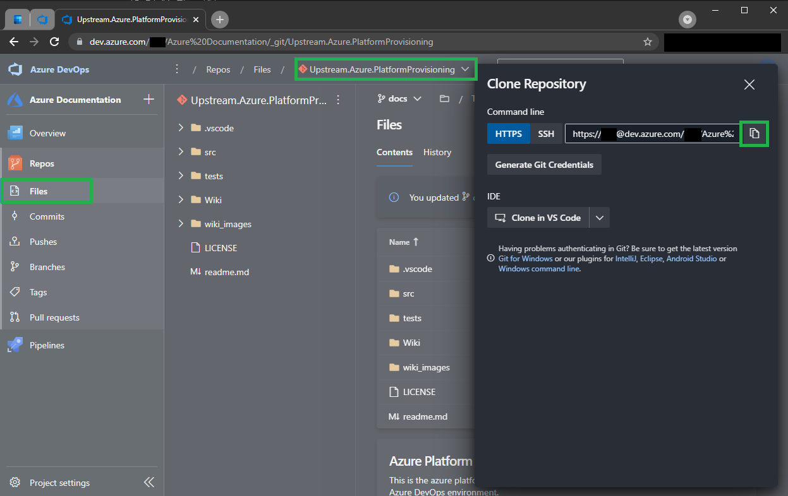

[[_TOC_]]

# How to use the scripts

To use these scripts you simply add a Azure CLI step to your pipeline. Make sure to fill in the right subscription you want to use in the step and select the script from this repo you want to execute. If you are using classic release pipelines, we recommend making a taskgroup per script so you can re-use them easily.

## AzDocs Build

First of all you will need to "build" the scripts. This means you will need a build which gets the repo & submodule, copies the scripts to the `$(Build.ArtifactStagingDirectory)` and publishes the artifact to the internal Azure DevOps repo, so you can use it in your releases. We've provided the following YAML build to get this done.

1. Generate a new [Peronal Access Token](https://docs.microsoft.com/en-us/azure/devops/organizations/accounts/use-personal-access-tokens-to-authenticate?view=azure-devops&tabs=preview-page#create-a-pat).
2. [Base64 encode](https://www.base64encode.org/) the text `pat:<enterthePATfromstepone>`. For example: `pat:le5jjn4yskffufljovntjjjrtfzqyffvhec2b774a3zqauokbp4a` will give `cGF0OmxlNWpqbjR5c2tmZnVmbGpvdm50ampqcnRmenF5ZmZ2aGVjMmI3NzRhM3pxYXVva2JwNGE=`.
3. Find the repo url for your generic repository.



4. Go to pipelines and create a `New Pipeline` in the [Azure Documentations team project](/Azure/Documentation/Setup-Azure-DevOps-and-GIT#setup-azure-devops-%26-git).


5. For your source, select `Azure Repos Git`.


6. Select your company specific repository (in the example our company repo is called `Azure.Documentation`).


7. Select Started Pipeline (this doesn't really matter, but you need to choose something).


8. Replace the default YAML with following YAML in the pipeline:

```yaml
name: $(date:yyyy.MM.dd)$(rev:.r)-$(Build.SourceBranchName)
trigger:
  paths:
    exclude:
      - azure-pipelines.yml

resources:
  - repo: self

variables:
  # PLEASE ADD GIT_AUTH_HEADER TO YOUR PIPELINE VARIABLES AS A SECRET (SEE THE DOCS FOR MORE INFO)
  - name: UPSTREAM_REPO_URL
    value: <enter the generic repository url here>
  - name: DECODE_PERCENTS
    value: false

stages:
  - stage: Build
    displayName: Create AzDocs Pipeline Artifact
    jobs:
      - job: Build
        displayName: Build
        pool:
          vmImage: ubuntu-latest
        steps:
          - task: Bash@3
            displayName: "Get Submodule"
            inputs:
              targetType: "inline"
              script: 'git -c http.$(UPSTREAM_REPO_URL).extraheader="AUTHORIZATION: basic $(GIT_AUTH_HEADER)" submodule update --init --recursive'
          # Generic Wiki
          - task: CopyFiles@2
            displayName: "Copy Generic Wiki"
            inputs:
              SourceFolder: "Azure.PlatformProvisioning/Wiki"
              TargetFolder: "$(Build.ArtifactStagingDirectory)/Wiki"
          # Company Specific Wiki
          - task: CopyFiles@2
            displayName: "Copy Company Wiki"
            inputs:
              SourceFolder: "Wiki"
              TargetFolder: "$(Build.ArtifactStagingDirectory)/Wiki"
          - task: PublishBuildArtifacts@1
            displayName: "Publish AzDocs Artifact"
            inputs:
              PathtoPublish: "$(Build.ArtifactStagingDirectory)/Wiki"
              ArtifactName: "azdocs-wiki"
              publishLocation: "Container"
          # Generic src
          - task: CopyFiles@2
            displayName: "Copy Generic src"
            inputs:
              SourceFolder: "Azure.PlatformProvisioning/src"
              TargetFolder: "$(Build.ArtifactStagingDirectory)/src"
          # Company Specific src
          - task: CopyFiles@2
            displayName: "Copy Company src"
            inputs:
              SourceFolder: "src"
              TargetFolder: "$(Build.ArtifactStagingDirectory)/src"
          - task: PublishBuildArtifacts@1
            displayName: "Publish AzDocs Artifact"
            inputs:
              PathtoPublish: "$(Build.ArtifactStagingDirectory)/src"
              ArtifactName: "azdocs-src"
              publishLocation: "Container"
```


9. Click on `Variables`.


10. Click `New Variable`.


11. Enter `GIT_AUTH_HEADER` under the name and fill the value with the `base64` value from step 2 (So `cGF0OmxlNWpqbjR5c2tmZnVmbGpvdm50ampqcnRmenF5ZmZ2aGVjMmI3NzRhM3pxYXVva2JwNGE=`) and mark the variable as `Secret`. Click `Ok`.


12. Replace the `<enter the generic repository url here>` placeholder in the above YAML with the generic repo url from step 3.

13. Save & run the pipeline. Everything should turn green and you will have a build artifact!


## Disable "Limit job authorization scope" settings

_Make sure to have followed the steps in [AzDocs Build](#azdocs-build)_

In order to use the [AzDocs Build](#azdocs-build), you will need to disable some security settings in Azure DevOps. By default you cannot use builds from different teamprojects. In our case, we do want to do this on purpose. To correct this, we need to set the setting on 3 places:

1.  The organization level.
2.  The AzDocs TeamProject (you can find how to setup under [Setup Azure DevOps & GIT](/Azure/Documentation/Setup-Azure-DevOps-and-GIT#setup-azure-devops-%26-git)).
3.  Your own project's [Azure DevOps TeamProject](https://docs.microsoft.com/en-us/azure/devops/organizations/projects/create-project?view=azure-devops&tabs=preview-page).

### Disable "Limit job authorization scope" on organization level

First of all you need to make sure you disable multiple "limit job authorization scope" toggles on your organization level. To do this follow these steps:

1. Go to the main Azure DevOps overview page & click `Organization settings` in the left bottom.


1. Go to `Settings` under `Pipelines` & Disable the following 3 toggles: `Limit job authorization scope to current project for non-release pipelines`, `Limit job authorization scope to current project for release pipelines`, `Limit job authorization scope to referenced Azure DevOps repositories`.


### Disable "Limit job authorization scope" on teamproject level

Next you need to make sure you disable multiple "limit job authorization scope" toggles on your TeamProject level. You need to do this for your AzDocs Teamproject & your own teamproject. So make sure to follow these steps for both (or even more of your own) teamprojects:

1. Go to your Azure DevOps Teamproject (or the Azure Documentation teamproject) & click `Project settings` in the left bottom.


1. Go to `Settings` under `Pipelines` & Disable the following 3 toggles: `Limit job authorization scope to current project for non-release pipelines`, `Limit job authorization scope to current project for release pipelines`, `Limit job authorization scope to referenced Azure DevOps repositories`.


## Adding the subscriptions to your teamproject

To deploy resources in Azure, you need to tell Azure DevOps how to reach the Azure subscription. [Click here](https://docs.microsoft.com/en-us/azure/devops/pipelines/library/connect-to-azure?view=azure-devops) to go to the official microsoft documentation on this to add this connection. We strongly recommend to name the connection identical to the subscription name.

## Default variables

To standarize some of the often used variables, we've created a list of these variables. An overview can be found at [Azure CLI Snippets](/Azure/Azure-CLI-Snippets). In a lot of cases you will also see a lot of derrived parameter names. For example for the $(ResourceGroupName) variable you will see the `AppServiceResourceGroupName` parameter inside App Service scripts. And in Keyvault scripts you will see `KeyvaultResourceGroupName`. This is purposely done to make it absolutely clear which resource we are talking about. There are scripts which accept multiple ResourceGroupNames for multiple resources. A good example is the `Create-Web-App-Linux.ps1` script which accepts `AppServiceResourceGroupName` and `AppServicePlanResourceGroupName`. They can both be filled with the $(ResourceGroupName) variable.

Another option is to create variables for each resourcegroupname which defaults to $(ResourceGroupName). In the case of a YAML pipeline this would look something like this:

```yaml
variables:
  # Basic
  - name: AppServiceResourceGroupName
    value: $(ResourceGroupName)
  - name: AppServicePlanResourceGroupName
    value: $(ResourceGroupName)
```

The result is that you have a little more variables, but you can control your whole pipeline solely through variables without having to doubt which resources will be affected.

## Classic Pipelines

_Make sure to have followed the steps in [AzDocs Build](#azdocs-build) and [Adding the subscriptions to your teamproject](#adding-the-subscriptions-to-your-teamproject)_

To create a release pipeline for your app where you can use this boilerplate, there are a few steps you have to do and a few steps which are recommended but not required. Here will be described how to create such a pipeline.

1. Go to the releases page in your teamproject and create a new release pipeline definition.
2. In the `Pipeline` tab, under `Artifacts`, add a new artifact and select the [AzDocs Build](#azdocs-build) (make sure to select the right Project first). It's recommended to assign the Source alias: `Azure.Documentation` to avoid weird characters in the file paths.
3. Add the optional build artifact for your own software.
4. Rename the `Stage 1` _stage_. Let't call it `dev` (later _stages_ can be made, reproducing these steps but with `acc` or `prd` as the _Stage_-name.


5. Click the `0 jobs, 0 tasks` link in the `dev` _stage_.
6. In the left column, click the `+` in the top right and search for the _Azure CLI_ step.


7. Enter these parameters in the _Azure CLI_ step
   - Azure Resource Manager connection: \*select the connection created in the [Adding the subscriptions to your teamproject](#adding-the-subscriptions-to-your-teamproject) step
   - Script Type: _PowerShell Core_
   - Script Location: _Script Path_
   - Script Path (replace with real values): `$(System.DefaultWorkingDirectory)/Azure.Documentation/drop/<ResourceType>/<Script>.ps1` (you can use the file browser to select your script)
   - Script Arguments: `<insert the needed script arguments from the script you are calling>`
   - Access service principal details in script: <input type="checkbox" checked> (Required in rare cases for some scripts).


8. _Save_ & _Create Release_. Congratulations, you can now run your pipeline and spin up secure & compliant Azure resources.

> NOTE: However, there are a few more tips & tricks we found useful. The following paragraphs containing tips & tricks are optional.

### Taskgroup all the things

For reusability purposes within your teamproject, it is wise to create a taskgroup for each script you use. This means you can add this taskgroup (even multiple times) to every pipeline you like without having to define the script location & parameters again.

> NOTE: Taskgroups are unfortunately scoped to a Azure DevOps TeamProject. This means that you can't use your taskgroup between projects.

To create a taskgroup per script, follow the following tutorial:

1. Whenever you added the CLI step the first time, right click it and click on `Create task group`.


2. Give your taskgroup a fitting name (we choose to name the taskgroups identical to the scripts).


3. After creating the taskgroup, you can add a new step to your pipeline and search for your taskgroup (make sure to hit the `Refresh` button if you don't see your taskgroup in the list).


4. After you've added the taskgroup, you can fill in the variables with your desired values and run the pipeline.


> NOTE: Known limitation: Taskgroups can not have output parameters. So for anything that uses output parameters, the step needs to be added to the pipeline directly and cannot be in any taskgroup. We strongly recommend to use YAML pipelines to not run into these issues.

> NOTE: Another known limitation is that you can not add optional parameters to taskgroups. You always have to fill in a value to the parameters. To workaround this, we've added a variable to our `Variables` called `EmptyString` which has an empty value. This means that we can simply pass `$(EmptyString)` to these optional parameters and it will no longer give an issue!

### Taskgroup the pipeline itself

Classic Pipelines have the downside that you have to create your pipeline per environment. This can get nasty whenever you have a lot of environments or do a lot of changes on your pipeline. This is why we chose to "taskgroup the pipeline". The result is that you have 1 pipeline taskgroup which is added to each environment. Whenever you change your pipeline taskgroup, this goes for all your environments at once.

1. Go to your classic pipeline & edit it and go to your first environments pipeline (in this example it is `dev`).


2. Select all your tasks in the pipeline and rightclick --> `Create task group`


3. A new window will popup. We chose to name these taskgroups `[PIPELINE] <projectname>`. Now fill in the parameters. It is very likely that you can simply copy the parameter name and paste it as a variable (see screenshot below). This will just proxy your variables to the taskgroup.


4. You will now have a single taskgroup in your pipeline.


5. Switch to your other environment (in this example this is `acc`). Add the same taskgroup you just created to your pipeline.


From now on. Whenever you change something inside your `[PIPELINE]` taskgroup, it will effect all your environments without having to keep track of all the pipeline changes between environments. This will force you into keeping your environments identical (which in our opinion is required for realistic testability).

### Variable groups

In contrast to YAML pipelines, we recommend using variable groups when using classic pipelines. This is so you can organize your variables between pipelines. For example if you have one central Log Analytics Workspace, you don't want 100 references to this resource. You can use a variable group to define the resource id and attach that variable group to all of your pipelines.

In YAML we recommend NOT doing this simply because of the "Infrastructure as Code" principle. This means that all the information needed for your pipeline should be in your repository & under sourcecontrol. Next to that; with YAML pipelines can you actually create pipelines per branch. In this case you can change/add/remove variables in that specific branch. This would not be possible if you use a variable group.

The only exception we make for using variable groups in YAML pipelines is when we are storing secrets. You don't want these in your repository due to security concerns :).

### Variable nesting

We recommend nesting variables and leveraging system variables. This means you will have a more standarized/consistent platform across your environments.
Below you can find an example where we define our Teamname & Projectname and re-use those, along with the `Release.EnvironmentName` systemvariable, to create our resourcegroup name. Note that in the example below the result for your `dev`, `acc`, and `prd` environments will be respectively: `AwesomeTeam-MyFirstProject-dev`, `AwesomeTeam-MyFirstProject-acc` and `AwesomeTeam-MyFirstProject-prd`.

This means you don't have to redefine the resourcegroupname for each environment and that if you, in a later stadium, choose to create a new environment, you don't have to go through your variables again. You can simply clone the environment, rename it & roll out the release.


### Pinning a specific version

When working with the Azure Documentation project, we can imagine that you might not want the latest version of this project, but you would like to 'pin down' a specific version.
You can configure this in your release:

1. Go to the release you would like to deploy
2. Click on Create Release
3. Click on the Artifact for your Azure Documentation project
4. Click on the dropdown for _Default version_ and pick 'Specific version'


5. Then pick the version you would like to pin down
6. You are done, you can now deploy all your releases with this specific version

## YAML Pipelines

_Make sure to have followed the steps in [AzDocs Build](#azdocs-build) and [Adding the subscriptions to your teamproject](#adding-the-subscriptions-to-your-teamproject)_

The recommended way of building pipelines is using YAML pipelines. To make using this boilerplate convenient for you, we've added a few ways of using it in your projects.

First of all, and most important, in each wiki page for the scripts we've added a piece of YAML code which you can conveniently copy & paste into your own YAML pipelines. The only thing you need to do is strip the parameters you don't need from this. This means that adding resources to your pipeline is as simple as just copy & paste and managing the parameters!

Next to this we've also made a few examples on how to create a pipeline with two goals in mind:

- Examples how to setup a pipeline in general which supports multiple environments without having to redefine your pipeline for each environment (to guarantee reproducibility in your platform across environments).
  - Generic/Bare Orchestrator Pipeline (this is the root file which is being imported in your pipelines) - `templates/Examples/General/pipeline-orchestrator.yml`
    - Generic/Bare Build template - `templates/General/pipeline-build.yml`
    - Generic/Bare Release template - `templates/ General/pipeline-release.yml`
- Examples for specific "often used" resources
  - FunctionApp Orchestrator Pipeline (this is the root file which is being imported in your pipelines) - `templates/Examples/FunctionApp/pipeline-orchestrator.yml`
    - FunctionApp Build template - `templates/Examples/FunctionApp/pipeline-build.yml`
    - FunctionApp Release template - `templates/Examples/FunctionApp/pipeline-release.yml`
  - WebApp Orchestrator Pipeline (this is the root file which is being imported in your pipelines) - `templates/Examples/WebApp/pipeline-orchestrator.yml`
    - WebApp Build template - `templates/Examples/WebApp/pipeline-build.yml`
    - WebApp Release template - `templates/Examples/WebApp/pipeline-release.yml`

PS. Sorry for not providing links, but the Azure DevOps wiki doesn't allow links to .yml files :(.

### Pipeline structure

As with Classic Pipelines, by default you need to create a pipeline per stage in a YAML pipeline. In our vision you only have one single truth for your platform, which should be reproducable on each environment. This means that you will only need one release pipeline and one build pipeline. To get this done, we've created a setup where we have a so called "orchestrator pipeline" which executes the build & release pipeline on the right moments. The build & release pipeline are written inside a separate yaml file. This way you can simply load the pipelines at the right moment. The pipeline architecture looks like this:


To achieve this, your stages in your ochestrator file will look something like this:

```yaml
variables:
  # Basic
  - name: TeamName
    value: TeamRocket
  - name: ProjectName
    value: TestApi

stages:
  - stage: "Build"
    jobs:
      - job: Build
        displayName: "Build"
        steps:
          - template: pipeline-build.yml

  - stage: "dev"
    displayName: "Deploy to dev"
    jobs:
      - template: pipeline-release.yml
        parameters:
          SubscriptionName: "MY DEV SUBSCRIPTION"
          EnvironmentName: dev
          TeamName: $(TeamName)
          ProjectName: $(ProjectName)

  - stage: "acc"
    displayName: "Deploy to acc"
    jobs:
      - template: pipeline-release.yml
        parameters:
          SubscriptionName: "MY ACC SUBSCRIPTION"
          EnvironmentName: acc
          TeamName: $(TeamName)
          ProjectName: $(ProjectName)
```

As you can see, we call the `pipeline-release.yml` twice. Once for `dev` and once for `acc`. This means that you will have identical environments. Inside the `pipeline-release.yml` you can use the parameters to generate the correct naming for your environment. For example, you can generate your resourcegroupname as following:

```yaml
variables:
  - name: ResourceGroupName
    value: ${{ parameters.TeamName }}-${{ parameters.ProjectName }}-${{ parameters.EnvironmentName }}
```

For the `dev` environment this will be `TeamRocket-TestApi-dev` and for `acc` it will be `TeamRocket-TestApi-acc`. This will also result in a very consistent naming scheme across your environments.

### Unique pipeline for each branch

A good thing to realise is, that since your pipeline is now part of your code, you also have a pipeline per branch. This means that with YAML pipelines (in opposition to classic pipelines) you can have a pipeline for each branch you create. It is perfectly sane to have a new API introduced in your project inside a branch which you want to test on Azure. For this you can, inside your branch, edit your release pipeline and deploy this new API. After testing it all inside your branch, you can pull-request the software & accompanying pipeline to master alltogether, under quality control through your PR!

### Variablemanagement

In YAML pipelines we take a slightly different approach to manage our variables. In opposition to classic pipelines, we consciously choose not to use `variable groups`. We put our variables inside our YAML pipelines itself. This has two major reasons. The first reason is that we want our variables under sourcecontrol, which means pipelines, including variables, will be merged to master using pull-requests. This means that your pipelines are under quality control as well! The second reason is that with YAML pipelines (again in opposition to classic pipelines) you can have a pipeline per branch like described in [Unique pipeline for each branch](#unique-pipeline-for-each-branch).

The only downside to this approach is that you don't have any shared variables between pipelines and that you can get some duplicate variables accross pipelines. This however does have the upside that if you need to change a "shared" variable, it will in this case not affect all pipelines at the same time (so you don't break all of your pipelines at the same time by changing one variable).

### Secretsmanagement

_Make sure you read the information from [Variablemanagement](#variablemanagement) first._

In opposition to normal variables, the only exception we make is for secrets. Since you don't want your secrets under sourcecontrol or, for that matter, plaintext at all, we need another solution for this. In this case you are pretty much free to use the variable groups in the library or use the variables inside the pipeline itself. Make sure to mark the variables as secret in both those options.

The same also counts for secure files (we use this for certificates for example). Those will NOT be in your repository due to the sensitive nature of those files. You can store them under the `Secure files` tab under the `Libary` tab inside the `Pipelines` module. [For more information about `Secure files`, please click here](https://docs.microsoft.com/en-us/azure/devops/pipelines/library/secure-files?view=azure-devops).

### Getting the AzDocs Build Information

For using the AzDocs Scripts in your YAML pipeline, you will need to include the following step in your pipeline:

```yaml
- task: DownloadPipelineArtifact@2
  displayName: Download AzDocs Artifact
  inputs:
    buildType: "specific"
    project: "<TeamProjectGuid>"
    definition: "<BuilddefinitionId>"
    buildVersionToDownload: "latestFromBranch"
    branchName: "refs/heads/master"
    artifactName: "azdocs-src"
    targetPath: "$(Pipeline.Workspace)/AzDocs"
```

For this you will need the `TeamProjectGuid` and the `BuilddefinitionId` for the AzDocs build. The easiest way to fetch the `BuilddefinitionId` id is to go to your pipelines overview and get the builddefinition id from your URL bar (see screenshot below).


Next you will need to fetch the `TeamProjectGuid`. The easiest way to do this is to go to the following URL in the same browser where you are logged in to Azure DevOps (this omits you having to fiddle with authentication in a rest call):

`https://dev.azure.com/<organization>/_apis/projects/<projectname>?api-version=6.0`

This pretty much boils down to something like this:

`https://dev.azure.com/mycompany/_apis/projects/Azure%20Documentation?api-version=6.0`

The first part of the response will be something like: `{"id":"57548766-4c42-4526-afb0-86b6aa17ee9c",`. In this case the GUID `57548766-4c42-4526-afb0-86b6aa17ee9c` is your `TeamProjectGuid`.

The final YAML for downloading the AzDocs artifact in this case will look like this:

```yaml
- task: DownloadPipelineArtifact@2
  displayName: Download AzDocs Artifact
  inputs:
    buildType: "specific"
    project: "57548766-4c42-4526-afb0-86b6aa17ee9c"
    definition: "853"
    buildVersionToDownload: "latestFromBranch"
    branchName: "refs/heads/master"
    artifactName: "azdocs-src"
    targetPath: "$(Pipeline.Workspace)/AzDocs"
```

The scripts will be available like described on the wiki (For example: your `Create-ResourceGroup.ps1` script will be available under `$(Pipeline.Workspace)/AzDocs/Resourcegroup/Create-ResourceGroup.ps1`).

### Pinning a specific version

If you want to make your own scripts, you will need to define the AzDocs branch you are working in. You can make this configurable at runtime by changing `branchName: "refs/heads/master"` to `branchName: "refs/heads/$(AzDocsBranchName)"` and while editing your pipeline going to `Variables`, adding the `AzDocsBranchName` with value `master` and enabling the `Let users override this value when running this pipeline` option (See screenshot below):


Instead of specifying a specific branch, you can also specify a specific version. This can be done by using the following YAML task:

```yaml
- task: DownloadPipelineArtifact@2
  displayName: Download AzDocs Artifact
  inputs:
    source: "specific"
    artifact: "azdocs-src"
    path: "$(Pipeline.Workspace)/AzDocs"
    project: "$(AzDocs.TeamProject.Id)"
    pipeline: "$(AzDocs.Build.Definition.Id)"
    runVersion: "specific"
    runId: "<BuildId>"
```

You can find the build id by going to the pipeline that contains your artifact and finding the build id:


### Deploying to Virtual Machines

Sometimes we still need to work with virtual machines (IaaS). Some of us are unlucky enough to work in a hybrid situation where they have Azure on one side, and an on-premises environment on the other side. Sometimes you also want to deploy software from your CICD pipelines to these on-premises machines or Azure VM's. In this case you need to know how to onboard those machines into Azure DevOps. Today is your lucky day, here is a crash course & provided script on how to do this. For YAML pipelines you need to onboard your machines into `Environments`. This is a little different from the old `Deployment Groups` with classic pipelines.

First of all you will need to onboard your machines into Azure DevOps Environments. Currently we've only documented this for Windows machines. For linux you will need to do something similar to the following procedure:

For windows you can use this oneliner to onboard your machine:

```powershell
$AzureDevOpsOrganizationName='myorganization';$AgentDisk='D';$AzureDevOpsProjectName='MyProject';$EnvironmentName='dev';$VirtualMachineResourceTags='MyApplication,AnotherApplication';$ServiceAccountUserName='MYDOMAIN\svc_SomeUser';$ServiceAccountPassword='MyServicePassword';$PersonalAccessToken='ThisIsMyPersonalAccessToken';$ProxyUrl='';$AgentVersion='2.189.0'; $ErrorActionPreference="Stop";If(-NOT ([Security.Principal.WindowsPrincipal][Security.Principal.WindowsIdentity]::GetCurrent() ).IsInRole( [Security.Principal.WindowsBuiltInRole] "Administrator")){ throw "Run command in an administrator PowerShell prompt"};If($PSVersionTable.PSVersion -lt (New-Object System.Version("3.0"))){ throw "The minimum version of Windows PowerShell that is required by the script (3.0) does not match the currently running version of Windows PowerShell." };If(-NOT (Test-Path $AgentDisk':\yamlagent')){mkdir $AgentDisk':\yamlagent'}; cd $AgentDisk':\yamlagent'; for($i=1; $i -lt 100; $i++){$destFolder="A"+$i.ToString();if(-NOT (Test-Path ($destFolder))){mkdir $destFolder;cd $destFolder;break;}};Write-Host "Dest folder: $destFolder"; $agentZip="$PWD\agent.zip"; $DefaultProxy=[System.Net.WebRequest]::DefaultWebProxy;$securityProtocol=@();$securityProtocol+=[Net.ServicePointManager]::SecurityProtocol;$securityProtocol+=[Net.SecurityProtocolType]::Tls12;[Net.ServicePointManager]::SecurityProtocol=$securityProtocol;$WebClient=New-Object Net.WebClient; $Uri="https://vstsagentpackage.azureedge.net/agent/$($AgentVersion)/vsts-agent-win-x64-$($AgentVersion).zip";if($ProxyUrl){$WebClient.Proxy=New-Object Net.WebProxy($ProxyUrl, $True);} $WebClient.DownloadFile($Uri, $agentZip);Add-Type -AssemblyName System.IO.Compression.FileSystem;[System.IO.Compression.ZipFile]::ExtractToDirectory($agentZip, "$PWD"); $optionalParameters = @(); if ($ProxyUrl) { $optionalParameters += '--proxyurl', "$ProxyUrl" } ;.\config.cmd --environment --environmentname $EnvironmentName --addvirtualmachineresourcetags --virtualmachineresourcetags $VirtualMachineResourceTags --agent "$($env:COMPUTERNAME)-YAML-$destFolder" --runasservice --windowsLogonAccount $ServiceAccountUserName --work '_work' --url "https://dev.azure.com/$($AzureDevOpsOrganizationName)/" --projectname $AzureDevOpsProjectName --auth PAT --token $PersonalAccessToken --windowsLogonPassword $ServiceAccountPassword @optionalParameters; Remove-Item $agentZip;
```

These variables at the start of this script can be edited:

| Variable                     | Description                                                                                                                                                                                                                                                                                                                                                                                                        |
| ---------------------------- | ------------------------------------------------------------------------------------------------------------------------------------------------------------------------------------------------------------------------------------------------------------------------------------------------------------------------------------------------------------------------------------------------------------------ |
| $AzureDevOpsOrganizationName | The name of your Azure DevOps organization. This is the name in the URL behind `https://dev.azure.com/`. So in the case of `https://dev.azure.com/myorg` the value will be `myorg`                                                                                                                                                                                                                                 |
| $AgentDisk                   | Which disk do you want to put the AzDo agent.                                                                                                                                                                                                                                                                                                                                                                      |
| $AzureDevOpsProjectName      | The TeamProject name where you want to onboard these machines.                                                                                                                                                                                                                                                                                                                                                     |
| $EnvironmentName             | The name of the environment to onboard your machine into. It's likely that you would use `dev`, `acc`, or `prd` here. Make sure you've created the environment before running this script.                                                                                                                                                                                                                         |
| $VirtualMachineResourceTags  | Which tags should the machine get. These tags can be used to select machines while you deploy. For example add the tag `MyApplication`. Later in your release you can simply say: Deploy my software to all machines with the tag `MyApplication`. The expectation is that those tags are identical between environments. `NOTE: this value is comm separated (e.g. MyApplication,AnotherApplication,AnotherTag)`. |
| $ServiceAccountUserName      | The user under which the Azure DevOps agent should run. You can also pass `NT AUTHORITY\SYSTEM` and pass a fake password to the `ServiceAccountPassword` parameter (e.g. `somethingsomething`). Make sure this user has the right permissions to do the stuff you want to do in your pipeline.                                                                                                                     |
| $PersonalAccessToken         | The PAT which you can create under your account in Azure DevOps                                                                                                                                                                                                                                                                                                                                                    |
| $ProxyUrl                    | The Proxy URL. This has been tested with using a HTTP proxy. Can be left blank in order to NOT use a proxy at all.                                                                                                                                                                                                                                                                                                 |
| $AgentVersion                | The version of the agent. Check [Github](https://github.com/microsoft/azure-pipelines-agent/releases) for the latest version.                                                                                                                                                                                                                                                                                      |

After onboarding your machine you can use this machine from your YAML pipeline. You can run a stage on the onboarded machine using the following YAML:

```yaml
- stage: dev
  jobs:
    - deployment: "Deploy_dev"
      environment:
        name: dev
        resourceType: VirtualMachine
        tags: MyMachineTag
      strategy:
        runOnce:
          deploy:
            steps:
              - template: pipeline-release.yml
                parameters:
                  SomeParameter: myvalue
```

Voilà! You can now deploy to your virtual machines the same way as you deploy to Azure PaaS resources!

### Deploying to SelfHosted Agents in Pool

You even may want to deploy to your own (Selfhosted) agents in an Azure DevOps Pool. These can be used in your classic or yaml pipelines for deployments or even builds. The agents may run on a Windows/Linux/MAC VM or a container. If you need a proxy to reach the URL of Azure DevOps, make sure you can reach this proxy from the VM or container.

Before you start installing the agent, make sure you already created a Pool in you project or organisation under: `settings - Agent Pools`.
Instructions can also be found online:

[Self-hosted Linux agents](https://docs.microsoft.com/nl-nl/azure/devops/pipelines/agents/v2-linux?view=azure-devops)

[Self-hosted Windows agents](https://docs.microsoft.com/nl-nl/azure/devops/pipelines/agents/v2-windows?view=azure-devops)

Currently we've only documented the onboarding of an agent in a pool only for Windows machines. For linux you will need to do something similar to the following procedure:

For windows you can use this oneliner to onboard your machine:

```powershell
$AgentVersion='2.190.0';$URL='https://dev.azure.com/<your_organisation>';$AgentDisk='C';$ServiceAccountUserName='NT AUTHORITY\SYSTEM';$ServiceAccountPassword='[MYSERVICEPASSWORD]';$PersonalAccessToken='[MYPERSONALPAT]';$Pool='MyDevOpsPool';$ErrorActionPreference='Stop';If(-NOT ([Security.Principal.WindowsPrincipal][Security.Principal.WindowsIdentity]::GetCurrent() ).IsInRole( [Security.Principal.WindowsBuiltInRole] “Administrator”)){ throw "Run command in an administrator PowerShell prompt"};If($PSVersionTable.PSVersion -lt (New-Object System.Version("3.0"))){ throw "The minimum version of Windows PowerShell that is required by the script (3.0) does not match the currently running version of Windows PowerShell." };If(-NOT (Test-Path $AgentDisk':\azagent')){mkdir $AgentDisk':\azagent'}; cd $AgentDisk':\azagent'; for($i=1; $i -lt 100; $i++){$destFolder="A"+$i.ToString();if(-NOT (Test-Path ($destFolder))){mkdir $destFolder;cd $destFolder;break;}};Write-Host "Dest folder: $destFolder"; $agentZip="$PWD\agent.zip";$DefaultProxy=[System.Net.WebRequest]::DefaultWebProxy;$securityProtocol=@();$securityProtocol+=[Net.ServicePointManager]::SecurityProtocol;$securityProtocol+=[Net.SecurityProtocolType]::Tls12;[Net.ServicePointManager]::SecurityProtocol=$securityProtocol;$WebClient=New-Object Net.WebClient; $Uri='https://vstsagentpackage.azureedge.net/agent/$($AgentVersion)/vsts-agent-win-x64-$($AgentVersion).zip';$WebClient.Proxy=New-Object Net.WebProxy($ProxyUrl, $True); $WebClient.DownloadFile($Uri, $agentZip);Add-Type -AssemblyName System.IO.Compression.FileSystem;[System.IO.Compression.ZipFile]::ExtractToDirectory($agentZip, "$PWD");.\config.cmd --unattended --url $URL --auth PAT --token $PersonalAccessToken --pool $Pool --agent "$($env:COMPUTERNAME)-$destFolder" --work '_work' --disableloguploads --runasservice --windowsLogonAccount $ServiceAccountUserName  --windowsLogonPassword $ServiceAccountPassword; Remove-Item $agentZip;
```

These variables at the start of this script can be edited:

| Parameter               | Required                        | Example Value                 | Description                                                                                                                                                                                                                                                                                                                                           |
| ----------------------- | ------------------------------- | ----------------------------- | ----------------------------------------------------------------------------------------------------------------------------------------------------------------------------------------------------------------------------------------------------------------------------------------------------------------------------------------------------- |
| $URL                    | <input type="checkbox" checked> | `https://dev.azure.com/myorg` | The URL of Azure DevOps appended with your Azure DevOps organization.                                                                                                                                                                                                                                                                                 |
| $AgentDisk              | <input type="checkbox" checked> | `C`                           | Which disk you want to use to put the AzDo agent files on.                                                                                                                                                                                                                                                                                            |
| $Pool                   | <input type="checkbox" checked> | `MyDevOpsPool`                | The Azure DevOps Pool you want want to onboard the agent on..                                                                                                                                                                                                                                                                                         |
| $ServiceAccountUserName | <input type="checkbox" checked> | `MYDOMAIN\svc_SomeUser`       | The Windows user under which the Azure DevOps agent should run in the format domain\userName or userName@domain.com. You can also pass NT AUTHORITY\SYSTEM and pass a fake password to the ServiceAccountPassword parameter (e.g. somethingsomething). Make sure this user has the right permissions to do the stuff you want to do in your pipeline. |
| $ServiceAccountPassword | <input type="checkbox" checked> | `passwordpassword`            | The password of the ServiceAccountUserName.                                                                                                                                                                                                                                                                                                           |
| $PersonalAccessToken    | <input type="checkbox" checked> | `ashoiuwjojwnfnsfljsfj`       | The PAT which you can create under your account in Azure DevOps.                                                                                                                                                                                                                                                                                      |
| $ProxyUrl               | <input type="checkbox">         | `http://my.proxy.nl:8080`     | The Proxy URL. This has been tested with using a HTTP proxy. Leave out in order to NOT use a proxy at all. Fill and add the parameter --proxyurl if you do (for download and running the agent).                                                                                                                                                      |
| $AgentVersion           | <input type="checkbox" checked> | `2.190.0`                     | The version of the agent. Check [Github](https://github.com/microsoft/azure-pipelines-agent/releases) for the latest version.                                                                                                                                                                                                                         |

After onboarding the agent in the Pool, you can use it from the Pool in your YAML or Classic pipeline. You can run a stage using the following YAML:

```yaml
  jobs:
  - deployment: Deploy
    pool: myPool
      vmImage: 'windows-2019'
    workspace:
      clean: all
    environment: dev
```

NB. contrary to Hosted agents, you must clean your workspace!

Voilà! You can now deploy the same way as you would using Azure Hosted Pools.

### Run your scripts with a different Azure CLI version

Sometimes, when Microsoft pushes a new version of Azure CLI, they introduce new bugs. This means that whenever the Azure CLI version on the hosted agents get updated, your pipelines might break. This can be very inconvenient whenever you need to run a pipeline which has this broken statement inside.

Don't worry, we've got you covered. We ran into this issue a few times and decided it was time for action... Github Actions to be precise. It is possible to run steps in your pipeline within a container you specify. To avoid the hassle for you, of building your own containers, we've done this for you. You can find the [OpenSource Github Repository here](https://github.com/AzDocs/devops.pipelines.container.azurecli). With every new version of Azure CLI, a new container will be build whenever we bump the version in the repository. Everyone can use this opensource container for free! The built version of this container can be found [here](https://hub.docker.com/r/azuredocumentation/devops.pipelines.container.azurecli).

You can simply use the following YAML in your pipeline to run your deployment inside this Azure CLI versioned container:

```yaml
jobs:
  - deployment: Deploy
    displayName: Deploy to dev
    environment: dev
    container: azuredocumentation/devops.pipelines.container.azurecli:2.25.0
```

Next to this, it's also possible to run individual tasks inside a container. This can be done with the following YAML:

```yaml
resources:
  containers:
    - container: azurecli-2-25-0
      image: azuredocumentation/devops.pipelines.container.azurecli:2.25.0
    - container: azurecli-2-26-1
      image: azuredocumentation/devops.pipelines.container.azurecli:2.26.1
steps:
  - task: SampleTask@1
    displayName: This task will be ran on the Azure DevOps Agent
    target: host
  - task: AnotherTask@1
    displayName: This task will be ran inside the container with Azure CLI 2.25.0
    target: azurecli-2-25-0
  - task: YetAnotherTask@1
    displayName: This task will be ran inside the container with Azure CLI 2.26.1
    target: azurecli-2-26-1
```
