[[_TOC_]]

# Regression Tests

_NOTE: This is not the final version of Regression Test chapter. Several basic components are in place, but it is not feature complete yet. Our roadmap contains epics to straighten this out._

When creating a boilerplate like this, you want a way to test the changes you make. We faced the same question and created a fitting answer. We've created a pipeline which tests all the resources & configurations automatically after each AzDocs change. It is designed in a way that you can use this pipeline in your own environment and, with a few variables you have to add to the pipeline, create your own test environment.

As said we've created a pipeline which calls all of the scripts we have (WIP). This repository also contains a C# API project which has a few features like "testing connections to databases", "testing storage accounts" and "testing cache providers". The idea is that we not only test the scripts, but also the connectivity & features of the created resources from other resources. This way we can verify that the resources and their connectivity works as designed.

## Setup the regression test pipeline in your environment

It's fairly easy to setup the regression test pipeline in your own environment. Theres a few things you have to do to get it running.

### Setup the AZDOCSREGRESSIONTESTSUBSCRIPTION service connection

First of all you need to add a `Azure Resource Manager` service connection to your AzDocs teamproject. This service connection will be a reference to your Azure Subscription where you want to deploy the regression tests. Please refer to [this link](https://docs.microsoft.com/en-us/azure/devops/pipelines/library/service-endpoints?view=azure-devops&tabs=yaml) for details on how to setup such a service connection. Important note is that for this service connection, the `service connection name` has to be `AZDOCSREGRESSIONTESTSUBSCRIPTION`. Unfortunately we had to statically name this is due to a technical limitation in Azure DevOps. It's technically impossible to enter a pipeline variable to be used as your subscription name in Azure CLI steps.

### Application Gateway certificate information

Before starting the next [Import the Regression Tests pipeline](#import-the-regression-tests-pipeline) chapter, make sure you have a domainname you can use for this testpipeline. We will use `something.mycompany.com` as an example. This value will be the `GatewayIngressDomainName`. You will need a matching certificate for this domainname (a wildcard certificate suffices). This certificate (in pfx format) has to be added to the secure files of your AzDocs Azure DevOps Team Project. Please refer to [this page](https://docs.microsoft.com/en-us/azure/devops/pipelines/library/secure-files?view=azure-devops) on how to add such a secure file. The value for the `GatewayCertificateSecureFileName` will be `something.mycompany.com.pfx` in our example. And last but not least, you will need the matching `GatewayCertificatePassword` for this secure file.

### Import the Regression Tests pipeline

_Make sure to have followed the steps in [Setup the AZDOCSREGRESSIONTESTSUBSCRIPTION service connection](#setup-the-azdocsregressiontestsubscription-service-connection) and [Application Gateway certificate information](#application-gateway-certificate-information)_

After setting the above connection up and getting the certificate information ready, we need to import the pipeline from the upstream repo's into our `Pipelines` module in Azure DevOps.

Follow these steps to get it done:

1. In your AzDocs team project, go to `Pipelines` and then click `New Pipeline`.

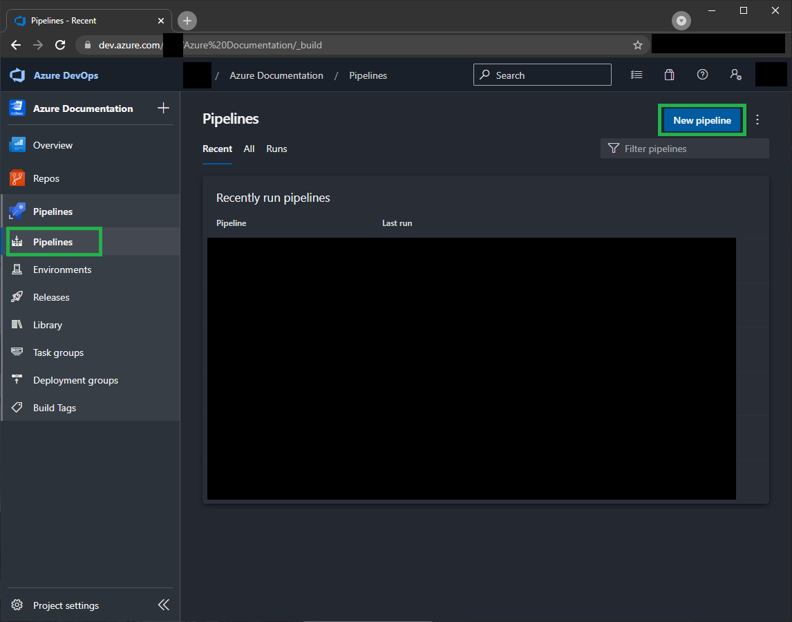

2. Select `Azure Repos Git` as the source provider.

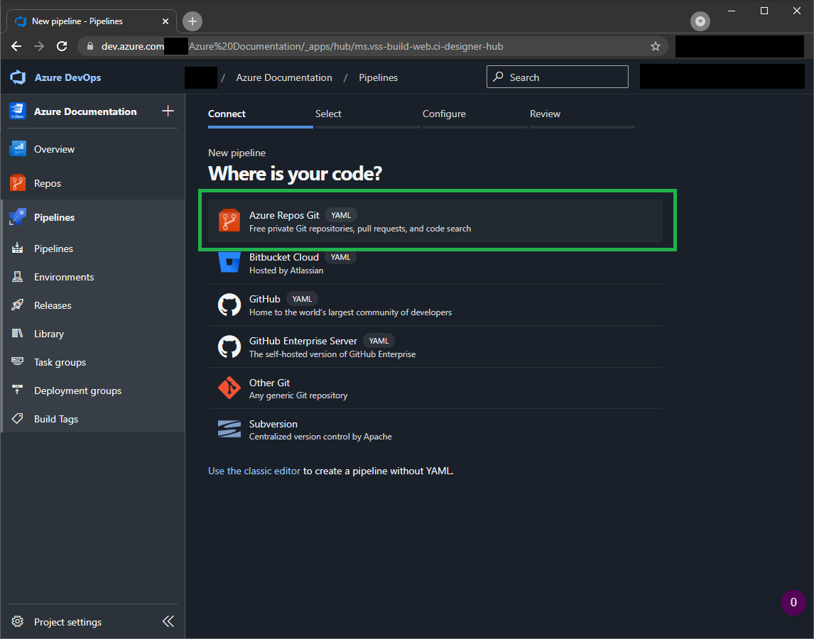

3. Select the Generic/Upstream repository.

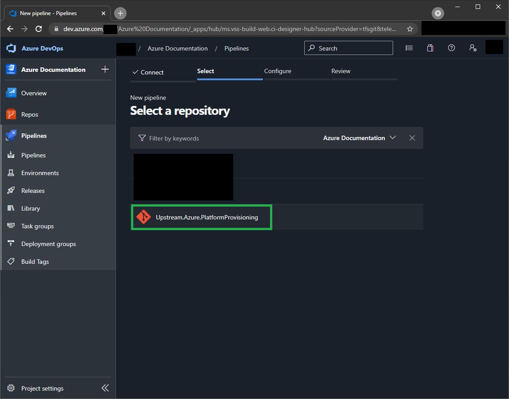

4. Select `Existing Azure Pipelines YAML file`.

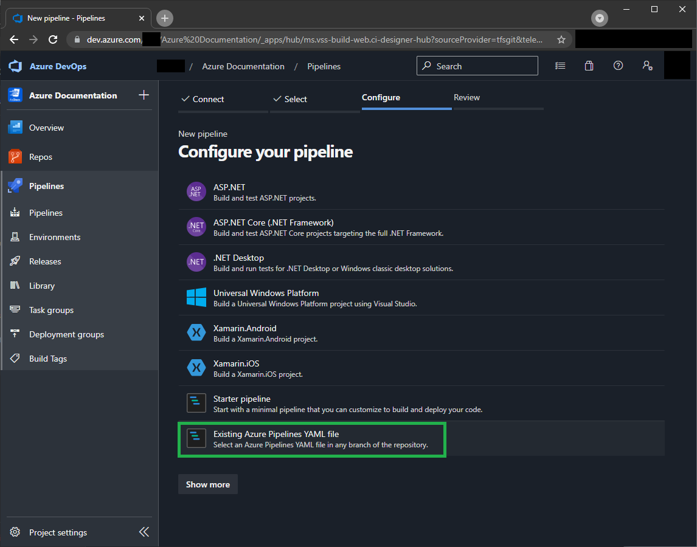

5. From the `Path` dropdown, select `/tests/Test.Regression/pipeline-orchestrator.yml` and click `Continue`.

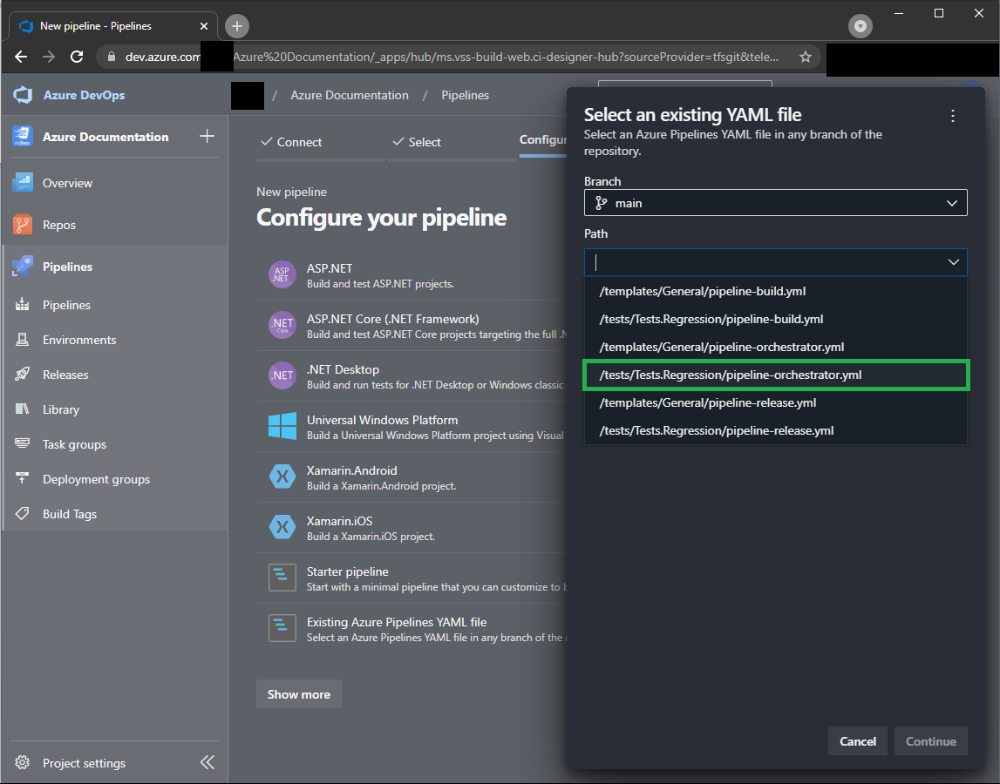

6. In the next screen, click `Variables` in the right top corner.

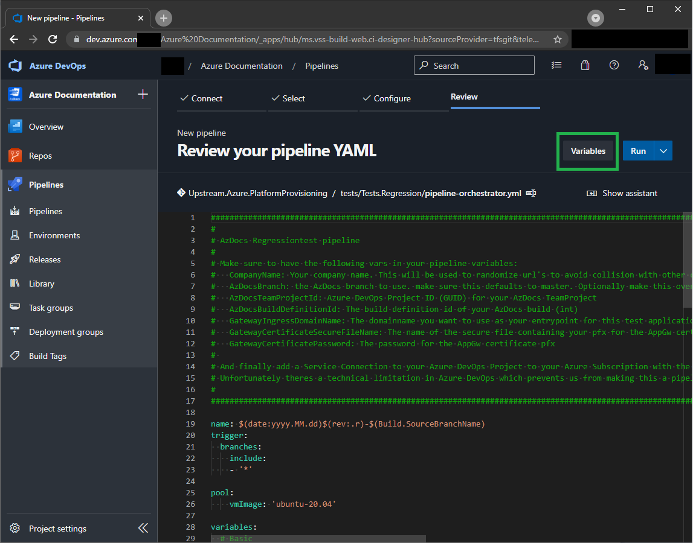

7. Click the `New Variable` button in the popup.

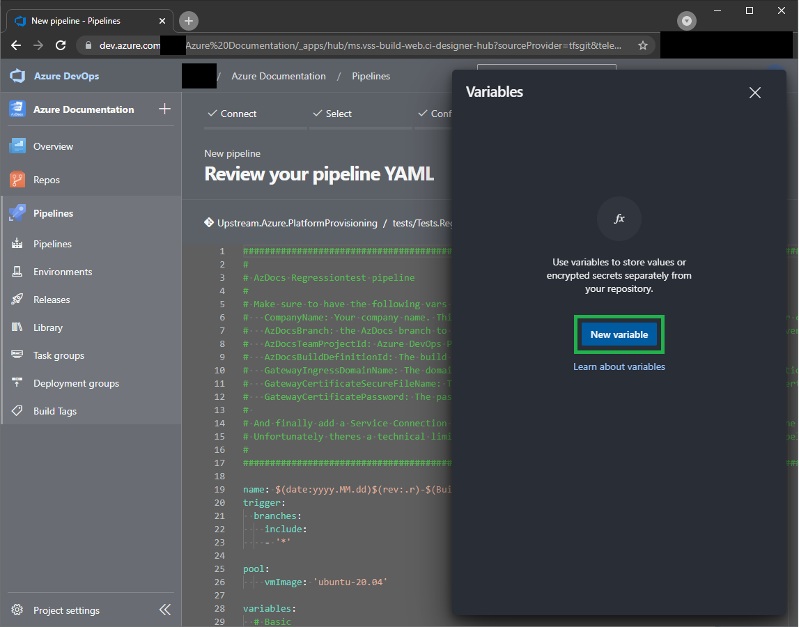

8. For the name enter `AzDocsBranch`. For the value enter `master`. Make sure you enable `Let users override this value when running this pipeline`. This will allow you to select different AzDocs branches to test later when running your pipeline.

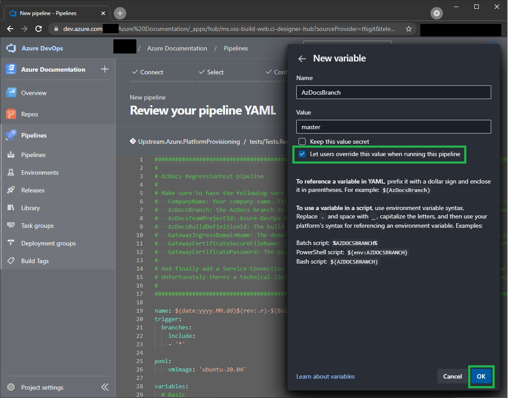

9. Click the `+` button in the right top corner of the popup.

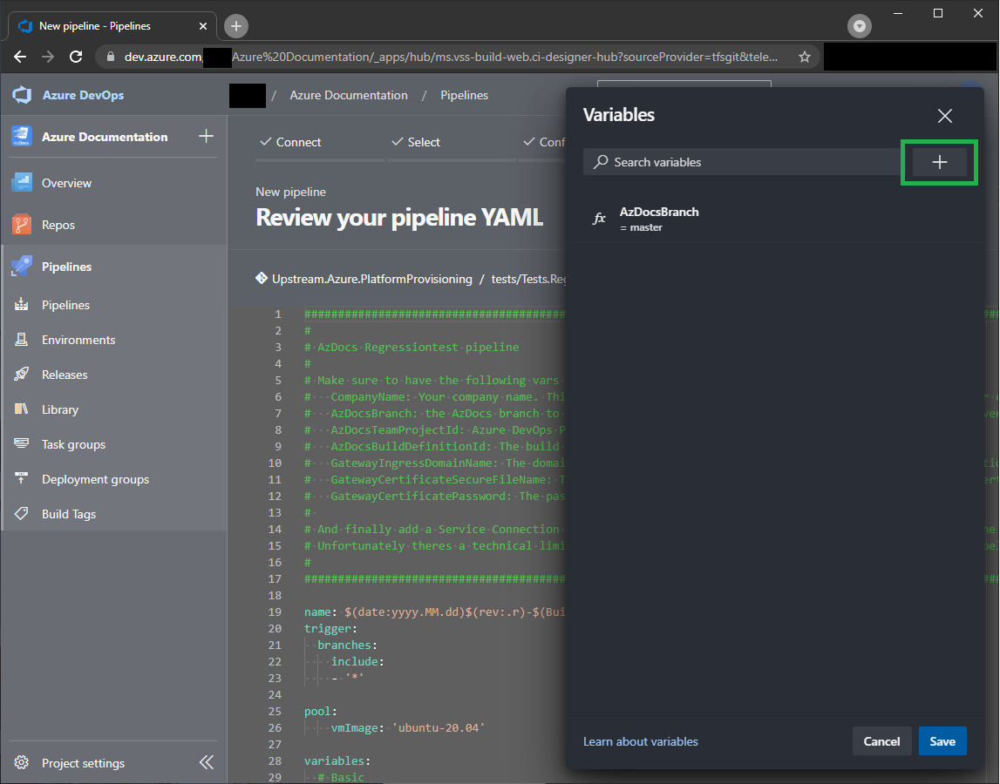

10. For the name enter `AzDocsBuildDefinitionId`. Please refer to [How to use the scripts](/Azure/Documentation/How-to-use-the-scripts#getting-the-azdocs-build-information) for getting the correct value. Click `Ok` to add the variable.

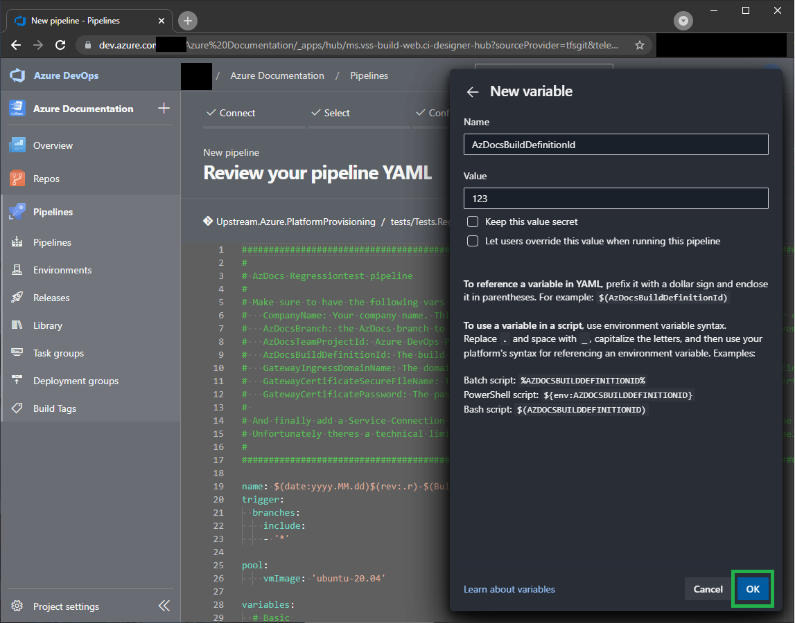

11. Repeat step 9 and then enter `GatewayCertificatePassword` for the name. For the value, refer to the [Application Gateway certificate information](#application-gateway-certificate-information) chapter. Make sure to enable the `Keep this value secret` checkbox. Click `Ok` to add the variable.

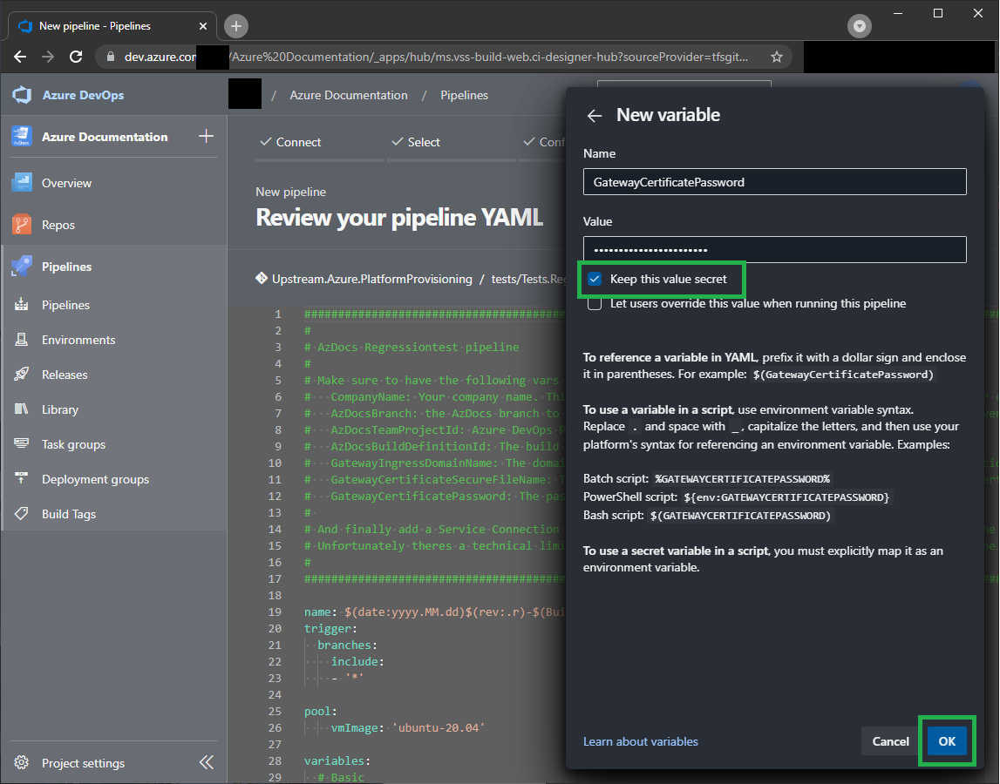

12. Repeat steps 9 & 10 for the following variables:

- Name `GatewayIngressDomainName`. For the value, refer to the [Application Gateway certificate information](#application-gateway-certificate-information) chapter.
- Name `GatewayCertificateSecureFileName`. For the value, refer to the [Application Gateway certificate information](#application-gateway-certificate-information) chapter.
- Name `CompanyName` with value `MyCompany` (Replace with your company name. Max 9 characters. Stick to alphanumeric). This company name will avoid collisions with resource namings from other companies, so choose something unique.
- Name `AzDocsTeamProjectId`. Please refer to [How to use the scripts](/Azure/Documentation/How-to-use-the-scripts#getting-the-azdocs-build-information) for getting the correct value.

Your variables screen should look like the image below. Click `Save` in the right bottom corner of the popup.

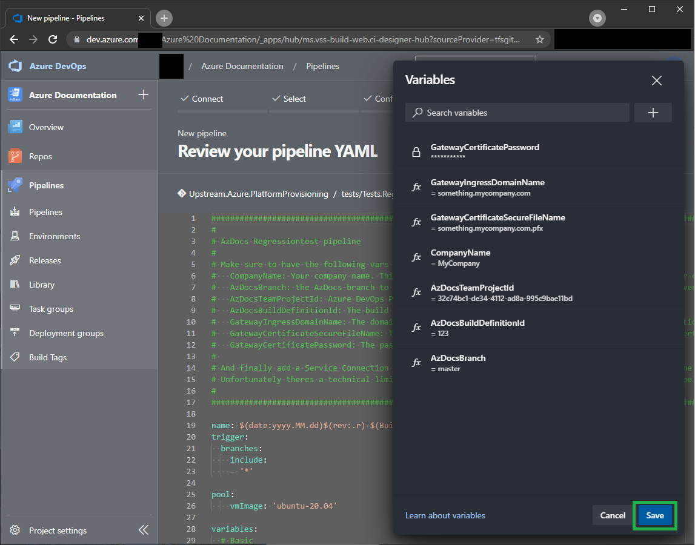

13. Click `Run` in the top right corner to start the pipeline run. This will start the full run.

14. Make sure to throw away the resulting resource group to avoid high unnecessary costs.

### Further TODOs

In the near future we will make sure to extend the amount of scripts being covered by the tests. Also we will include a set of [Playwright](https://playwright.dev/) tests to cover the testing after deploying the Test.API, so we can automatically verify the connectivity.
