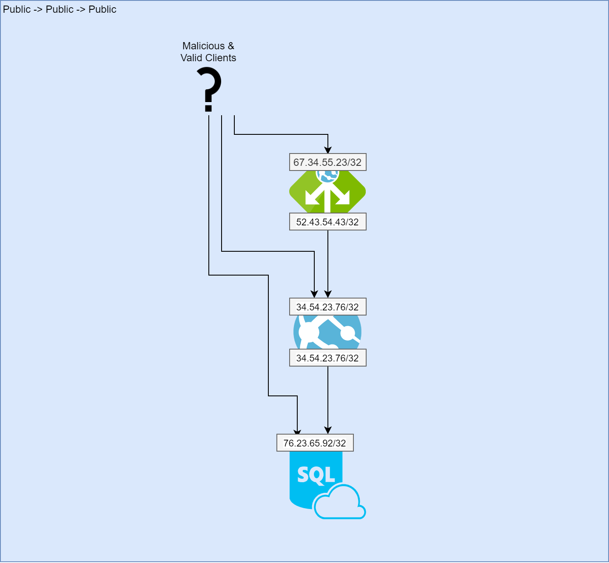
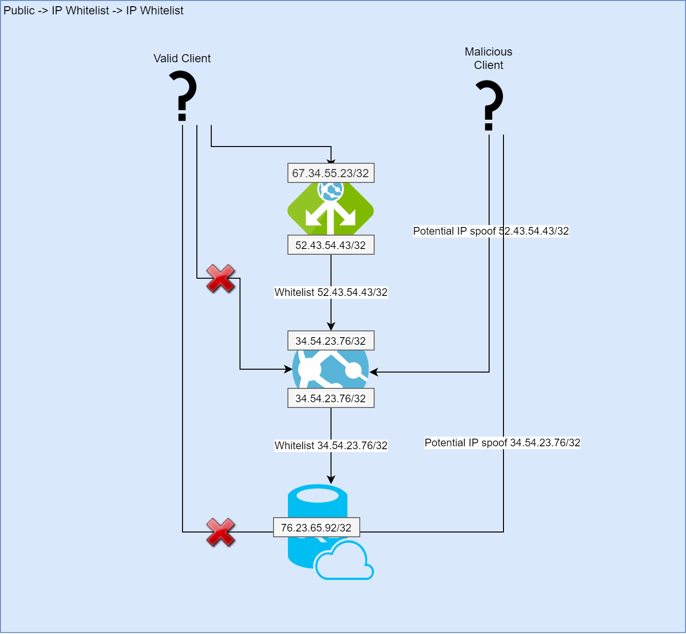
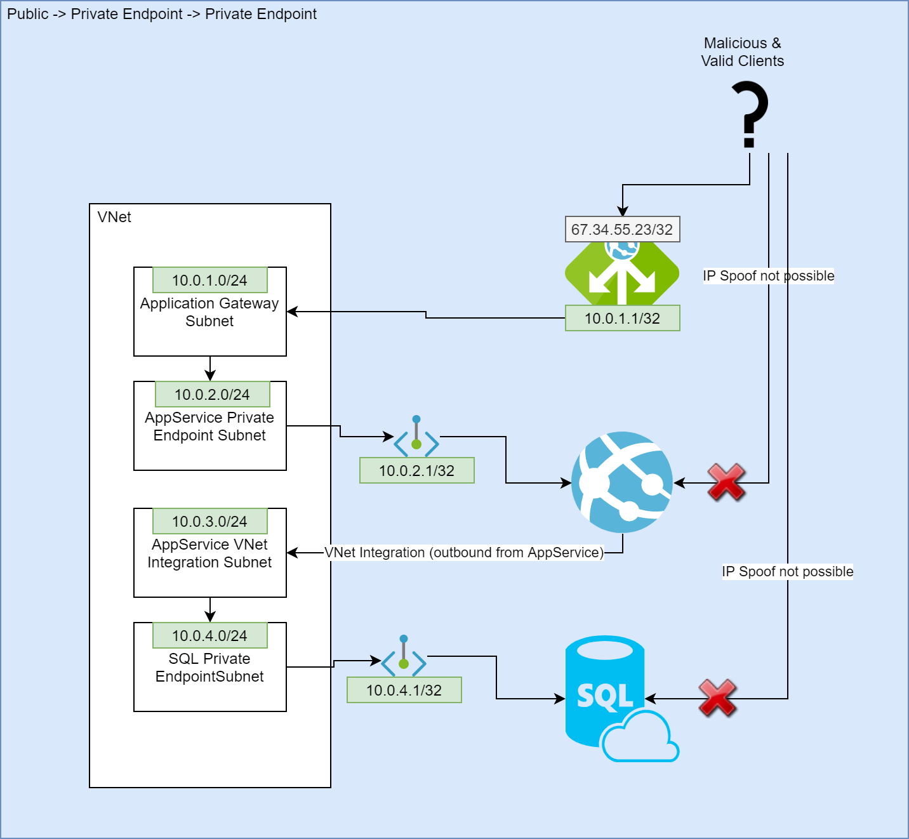
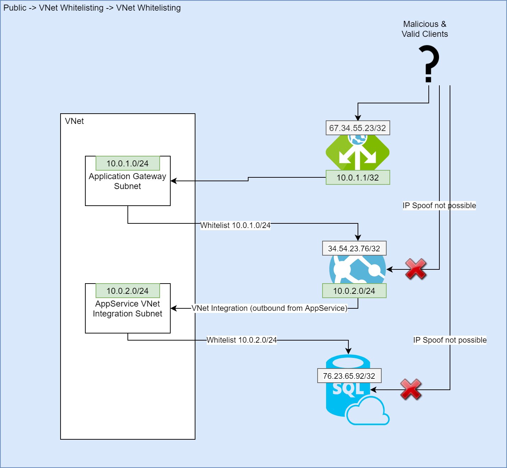

[[_TOC_]]

# Networking

There are different ways of doing networking within Azure. By default resources will either be public or have an IP Whitelist. By design we don't want to use public resources or use IP whitelists because of the potential insecurities in this. We made the choice to use two different ways of supporting connectivity; VNet whitelisting & Private Endpoint.

For your overview, there are 4 flavours of networking available to resources currently. It depends on the type of resource which methods are supported (from least desirable to most desirable):

- Public
- IP Whitelists
- Private Endpoints
- VNet Whitelisting

## When to use what?

If you use Azure to Azure communication, the general rule of thumb is to use [VNet whitelisting](#vnet-whitelisting) where applicable. If that's not possible, or you want to connect from on-premises networks, we use [private endpoints](#private-endpoints). If that is unavailable as well (For example; because the resource doesn't support VNet whitelisting and/or private endpoints), we fallback to public access with plain IP whitelists.
Another rule of thumb is to keep in mind that we don't want to use methods of vnet connectivity where we have to sacrifice a whole subnet due to a delegation (vnet integration for appservices have this problem) unless there is no other way. The reason for this is that this costs a lot of private IP's. If you have a tight private IP space, don't waste them on delegations :).

## Public networking

The least favorable way of networking within Azure is using public networking. This means that everyone can reach your public resources. For obvious security implications, **we strongly advise against using public resources**, unless it is meant to be public (for example a storage account with all public PDF's).

Drawing public networking in a picture would look something like this:



_In this example, both malicious and valid clients can simply reach the application gateway, app service & sql server without any effort through their public endpoints._

## IP Whitelists

A little better way to do networking is by adding IP whitelists. This way you can whitelist public ip's on Azure resources. The challenge in this will be getting the outbound public ip's from the calling Azure resources to be able to whitelist those IP's. We strongly suggest using VNet Whitelisting and/or private endpoints over using public ip whitelists.

Drawing IP Whitelisting in a picture would look something like this:



_In this example the appservice will whitelist it's calling party (the application gateway public ip) and blacklist all other IP's. The SQL database will whitelist it's calling party (the appservice public outbound ip) and blacklist all other IP's. Theoretically a potential attacker can send a ip spoofed request to the appservice or SQL server which will get processed, but never gets returned to the attacker._

## Private Endpoints

We see [private endpoints](https://docs.microsoft.com/en-US/azure/private-link/private-endpoint-overview) as a fallback scenario for resources that do not support [VNet whitelisting](#vnet-whitelisting). Also this is the main way of connecting from on-premises networks to Azure resources. The idea behind private endpoint is that your Azure Resource will get an endpoint for incoming traffic inside a subnet within your vnet. Azure also offers the option for the DNS entry of your resource to be changed from the public resource IP to the private endpoint ip automatically.

**DNS Example:**
If you have a SQL server with the name `testserver`, you will get a DNS record out of the box which looks like `testserver.database.windows.net` which resolves to a public ip, lets say `50.20.30.40`. It means that whenever you connect to your SQL Database you will set the connectionstring to `testserver.database.windows.net` and your application will resolve this to `50.20.30.40`.
Whenever we enable the private endpoint feature, microsoft will actually create a new DNS record `testserver.privatelink.database.windows.net` with your private ip, lets say `10.0.0.5`. The next step Microsoft does for you, is that within your VNet context the "public" DNS entry `testserver.database.windows.net` will resolve to a CNAME `testserver.privatelink.database.windows.net` which in its turn resolves to `10.0.0.5`. So within your VNet you will start connecting on a private IP, which allows you to completely disable the public endpoint if desired. If you resolve `testserver.database.windows.net` from outside your VNet, it will keep resolving to `50.20.30.40` (since you don't have connectivity to the private endpoint there).

To display private endpoints into an image would look something like this:



_In this example you see that the app service and the sql server get an endpoint inside their respective private endpoint subnets. This will result in the appservice being reachable on the ip `10.0.2.1` and the SQL server being reachable on `10.0.4.1`. All traffic will be routed through the VNet. Small note is that your calling services (for the App Service this is the Application Gateway and for the SQL Server this is the App Service) should have outgoing network connectivity to your VNet. For App Services & Functions this can be done using VNet integration. Malicious attackers have no way of connecting to the App Service or SQL Server, due to the fact that their public endpoints are simply disabled. This means that the App Service & SQL Server no longer have an public IP._

There are two big downsides to using private endpoint. The first is that it's currently impossible to firewall the private endpoints, which means that your private endpoint is available from your whole vnet & all networks attached to this vnet. Even trying to close of the private endpoint through usage of [NSG's](https://docs.microsoft.com/en-us/azure/virtual-network/network-security-groups-overview) on your private endpoints subnet simply does nothing. The second downside is that every private endpoint costs you a private ip from your private ip space. If you are limited on available IP's, this will be an expensive option. Because of those two reasons we prefer using [VNet Whitelisting](#vnet-whitelisting).

> NOTE: One of the funny things we noticed is that for AppServices & functions in particular, whenever you add a private endpoint you are unable to get public access working even after adding public ip's to your whitelist. You can fix this by using an [Application Gateway](https://docs.microsoft.com/en-US/azure/application-gateway/overview) in front of this App Service/FunctionApp with private endpoint.

### DNS

Whenever you want to use private endpoint there is a few things to know. The first of these things is that you will need a non-default DNS server to resolve your private endpoint DNS entries. The default DNS server from Azure will keep returning the public IP, which is undesired for your private endpoint situation. This means that you will need to define the "private endpoint dns server" in your Virtual Network as being the DNS server to use. The address to resolve your privatelink DNS entries from is `168.63.129.16`.

> OPTIONAL: If you do not want to set this DNS server for the whole VNet, there are ways to set this on a resourcelevel. For example adding `WEBSITE_DNS_SERVER=168.63.129.16` to your [application settings](https://docs.microsoft.com/en-us/azure/app-service/configure-common) in your App Service does this.

### Route your traffic through the VNet

Another thing to know when you use private endpoints, in combination with the Azure Private DNS, is that you need to make sure your resources will route all traffic through the VNet. For example: you need to add an [application setting](https://docs.microsoft.com/en-us/azure/app-service/configure-common) to your AppService that defines that you route this traffic through your VNet integration towards the VNet. For AppServices you can do this adding VNet-integration to your application settings (this is done by the AzDocs Add-VNet-integration-to-AppService or Add-VNet-integration-to-Function-App scripts). This setting will route all outbound traffic through your VNet. For more information, refer to [the microsoft documentation for vnet integration](https://docs.microsoft.com/en-us/azure/app-service/web-sites-integrate-with-vnet)

> NOTE: If you are using a recursive DNS server within your VNet in Azure which is on an addressrange defined in the RFC1918 specification, you don't need to explicitly route all traffic through your VNet.

### How to deploy to private resources: Azure DevOps Private Agents

A challenge you will be facing when you use private endpoints, is that your Azure DevOps hosted agents are unable to connect to your (now) private resource. This means that, for example, an application deploy to an appservice or adding a file to your storage account will fail. This means that you will have to host a private Azure DevOps agent inside your VNet to connect through the private endpoints. Instructions for creating can be found in [How to use the scripts](/Azure/AzDocs-v1/General-Documentation/How-to-use-the-scripts.md).

## VNet whitelisting

As mentioned, VNet whitelisting is the desired way of connecting your resources within Azure. The description we'd like to use is that VNet whitelisting means you allow a subnet in your VNet to connect to your Azure resource. Microsoft does some nice public/private network translation magic for this. The benefit is that you can choose any vnet/subnet combination to be whitelisted without the vnets actually [peered](https://docs.microsoft.com/en-US/azure/virtual-network/virtual-network-peering-overview), where private endpoints will limit you to stuff which is in the same vnet as the private endpoint. Technically this means that your public endpoint will be enabled. However Microsoft allows you to define which private resources (resources from within a vnet) can reach this public endpoint. By default this method will block all public traffic to the Azure resource, which is desired in our eyes.

VNet whitelisting described in an image looks something like this:



_In this example you see that the outbound traffic from the calling parties (for the App Service this is the Application Gateway and for the SQL Server this is the App Service) are being done through private routes. VNet whitelisting allows you to whitelist private subnets on your public Azure resource endpoint. This way your resources no longer need private endpoints to be able to get called securely from other Azure resources. The connectivity to your public Azure resource endpoint will be limited to the whitelisted subnets. All other traffic will be dropped before being processed. Small note is that your calling services (again; for the App Service this is the Application Gateway and for the SQL Server this is the App Service) should have outgoing network connectivity to your VNet. For App Services & Functions this can be done using VNet integration._

_Note: If you are using a storage account, you need to take extra steps to deploy to the storage account when using VNet whitelisting. For more information, see [Storage-Accounts](../Azure-CLI-Snippets/Storage-Accounts)._

## On-premises networks

There are several ways of connecting your resources in azure from & to on-premises resources:

- Azure ExpressRoute
- Site-to-site VPN using the Virtual Network Gateway
- Hybrid connections

Currently this stack has been tested using the ExpressRoute & the Virtual Network Gateway.

When connecting your Azure platform to your onpremises network, make sure that you DO NOT have any overlapping IP's.

We use two flavours of connecting from on-premises resources to Azure:

- HTTPS traffic --> We make sure to put an Application Gateway in front of the HTTP resource and connect the onprem resources via this Application Gateway.
- Other resources like SQL databases, storage account, redis cache etc --> You will need to create a private endpoint for your Azure Resource which will be used to connect to from on-premises. This means that your on-premises datacenter has to understand that the DNS entry for those resources don't resolve to the public ip of the azure resource, but the private ip of the private endpoint.

### DNS

> NOTE: This part of the documentation is still under construction. We want to offer a 1-click-solution for the DNS servers.

<font color="red">TODO: This needs an update. When having an on-prem DNS, you will get an issue with calling Azure private endpoints from onprem.</font>

Whenever you use an on-premises DNS server in combination with private endpoints there is a challenge to overcome: When do you resolve DNS entries from onpremises and when from the private endpoint DNS server from Azure itself?
The solution we found that worked best is to create a recursive dns server (a DNS proxy which does the querying for you instead of redirecting your DNS query to the target server). The reason why you want the DNS proxy to do the query itself is because if your resource lives on-premises and you do the DNS request from there, the Azure Private Endpoint DNS Server will return the public IP, since it sees you are NOT within the VNet. This will result in connection not being able to be made.
The technical implementation we have been using is to use bind9 as a DNS server with the following script:

```sh
#!/bin/sh
#
#  only doing all the sudos as cloud-init doesn't run as root, likely better to use Azure VM Extensions
#
#  $1 is the forwarder, $2 is the vnet IP range, $3 is the first dns, $4 is the second dns
#

touch /tmp/forwarderSetup_start
echo "$@" > /tmp/forwarderSetup_params

#  Install Bind9
#  https://www.digitalocean.com/community/tutorials/how-to-configure-bind-as-a-caching-or-forwarding-dns-server-on-ubuntu-14-04
echo 'debconf debconf/frontend select Noninteractive' | sudo debconf-set-selections
sudo apt-get update -y
sudo apt-get install bind9 -y

# configure Bind9 for forwarding
sudo cat > named.conf.options << EndOFNamedConfOptions
acl goodclients {
    $2;
    localhost;
    localnets;
};


options {
        directory "/var/cache/bind";

        recursion yes;

        allow-query { goodclients; };

        forwarders {
            $3;
            $4;
        };
        forward only;

        #dnssec-validation auto;

        auth-nxdomain no;    # conform to RFC1035
        listen-on { any; };
};

zone "azconfig.io" IN {
    type forward;
    forwarders {
        $1;
    };
};
zone "azmk8s.io" IN {
    type forward;
    forwarders {
        $1;
    };
};
zone "azure.com" IN {
    type forward;
    forwarders {
        $1;
    };
};
zone "azure.net" IN {
    type forward;
    forwarders {
        $1;
    };
};
zone "azure-api.net" IN {
    type forward;
    forwarders {
        $1;
    };
};
zone "azure-automation.net" IN {
    type forward;
    forwarders {
        $1;
    };
};
zone "azurecontainer.io" IN {
    type forward;
    forwarders {
        $1;
    };
};
zone "azurecr.io" IN {
    type forward;
    forwarders {
        $1;
    };
};
zone "azure-devices.net" IN {
    type forward;
    forwarders {
        $1;
    };
};
zone "azureedge.net" IN {
    type forward;
    forwarders {
        $1;
    };
};
zone "azurefd.net" IN {
    type forward;
    forwarders {
        $1;
    };
};
zone "azureml.ms" IN {
    type forward;
    forwarders {
        $1;
    };
};
zone "azure-mobile.net" IN {
    type forward;
    forwarders {
        $1;
    };
};
zone "azurewebsites.net" IN {
    type forward;
    forwarders {
        $1;
    };
};
zone "cloudapp.net" IN {
    type forward;
    forwarders {
        $1;
    };
};
zone "msecnd.net" IN {
    type forward;
    forwarders {
        $1;
    };
};
zone "onmicrosoft.com" IN {
    type forward;
    forwarders {
        $1;
    };
};
zone "signalr.net" IN {
    type forward;
    forwarders {
        $1;
    };
};
zone "trafficmanager.net" IN {
    type forward;
    forwarders {
        $1;
    };
};
zone "visualstudio.com" IN {
    type forward;
    forwarders {
        $1;
    };
};
zone "windows.net" IN {
    type forward;
    forwarders {
        $1;
    };
};
zone "windowsazure.com" IN {
    type forward;
    forwarders {
        $1;
    };
};

EndOFNamedConfOptions

sudo cp named.conf.options /etc/bind
sudo service bind9 restart

sudo apt-get upgrade -y
```
