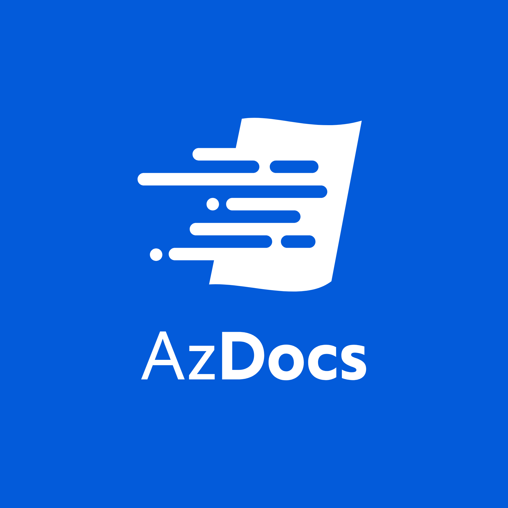

# AzDocs (Azure Documentation)

This is the AzDocs repository. This is meant to be imported into an Azure DevOps environment.

The idea behind this repository is that you are able to create compliant & secure resources within Azure without all the hassle of finding out how it all works and what you need.

- The documentation can be found in the `Wiki` directory. In Azure DevOps you can publish the `Wiki` folder as a Wiki (Publish Code as Wiki).
- The source code for the code snippits can be found in `src`.
- Unit tests for the snippits can be found in the tests directory. `NOTE: As of yet there are no unit tests yet.`
